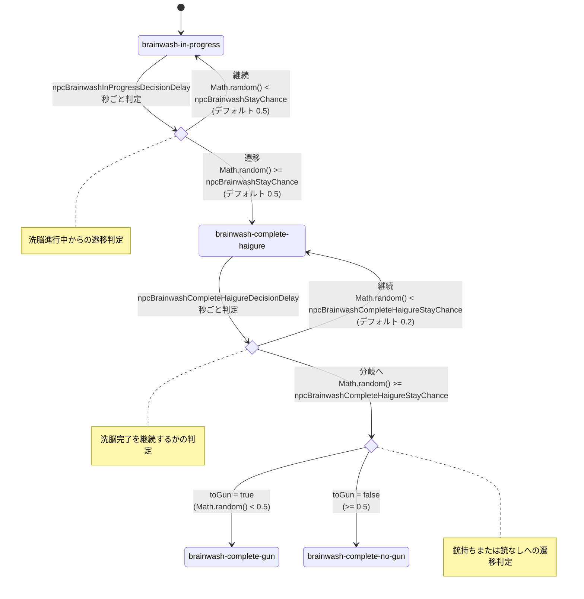

# HAIGURE SURVIVAL

ハイグレ洗脳されたい人向け一人称視点サバイバルゲームです。

ソースコードのみ配布しています。  
ゲームはウェブブラウザ上で起動します（推奨：Google Chrome）。起動方法は「必須手順」を参照してください。  
各種素材は各自でご用意ください。導入方法は「任意手順」を参照してください。  

バグ報告、機能追加提案などがありましたらissueを立ててください。

## 起動準備

### 必須手順（ゲームをブラウザで起動するまで）
1. Node.js 18 以上（npm 同梱）をインストールする。
   - 公式サイト（https://nodejs.org/ ）から LTS をダウンロードして実行する。
   - 画面の指示に従ってインストールを完了する。
2. このリポジトリのソースコードをダウンロードし、解凍する。
   - GitHub画面内の`Code`ボタン → `Download ZIP`ボタンでダウンロード可能。gitコマンドが使えるなら`git clone`でも可
   - フォルダごと任意の場所へコピーする。
   - 例: `D:\games\haigure_survival-main`
3. ターミナルを開き、プロジェクトフォルダへ移動する。
   - Windows の場合: PowerShell を開き、移動コマンドを実行。
     例: `cd D:\games\haigure_survival-main`
   - mac の場合: ターミナルを開き、移動コマンドを実行。
     例: `cd /Users/<ユーザー名>/games/haigure_survival-main`
4. 依存関係をインストールする。
   - `npm install` コマンドを実行する。
   - インストールに成功していても、何らかの注意文が表示されることがあります。明らかなエラーではない限り、一旦次に進んでみてください。
   - 【Windows, PowerShell】エラー`npm : このシステムではスクリプトの実行が無効になっているため、ファイル ～ を読み込むことができません。`が発生したら
     - スクリプトの実行ポリシーを一時的に変更すると解決するかもしれません。
     - 変更コマンド例：`Set-ExecutionPolicy -ExecutionPolicy RemoteSigned -Scope Process`
5. 開発用のサーバーを起動する。
   - `npm run dev` コマンドを実行する。
6. ブラウザで以下の動作確認用URLにアクセスする。
   - http://localhost:5175
7. ゲーム終了時には、開発用のサーバーを停止する。
   - PowerShellまたはターミナルで `Ctrl + C`

#### その他、エラーやトラブルが発生したら

上記の「必須手順」は、あくまで一般的なNode.jsおよびnpmのインストール手順です。本ゲーム特有の手順はほとんどありません。  
表示されたエラー文や実行したコマンド等でググる、またはAIに質問すればほぼ確実に解決方法にたどり着けるはずです。  

なお、香取犬は起動準備に関してのサポートやトラブルの対応はいたしかねますのでご了承ください。  

### 任意手順（準備した素材をゲームに読み込ませるには）

#### 素材用フォルダ構成
- `public/` 配下には任意でステージデータや各種素材を置くことができる。
  - フォルダ構成:
    ```
    public/
    ├─ audio/
    │  ├─ bgm/
    │  ├─ se/
    │  └─ voice/
    ├─ picture/
    │  └─ chara/
    └─ stage/
    ```
  - キャラクターフォルダ名の命名規則（実装準拠）:
    - `public/picture/chara/` は先頭2文字が音声ID（2桁）と一致するフォルダだけが優先割り当て対象（例: `05_big_sister`）。一致させない場合は任意名でよい。
    - `public/audio/voice/` はフォルダ名を参照しないため任意（管理上は「2桁ID + 任意文字列」にしておくと分かりやすい）。
    - `public/audio/bgm/` / `public/audio/se/` / `public/stage/` はキャラクターフォルダ不要。

#### BGM
- `public/audio/bgm/` に `mp3` を配置する。
  - ステージ JSON の `meta.name` と同名の `<name>.mp3` があれば、それを優先再生する。
    - 例: `public/stage/laboratory.json` の `meta.name` が `laboratory` の場合は `public/audio/bgm/laboratory.mp3`
  - 一致するファイルがない場合は、`public/audio/bgm/` 内の `mp3` からランダム再生する。
  - `public/audio/bgm/` に `mp3` が一つもない場合は再生しない。

#### SE
- `public/audio/se/` に以下のファイル名で配置する（形式: `mp3`）。
  - ビットの浮遊音: `FlyingObject.mp3`
  - ビットの警告音: `BeamShot_WavingPart.mp3`
  - ビットが狙いを定める音: `aim.mp3`
  - ビームの発射音: `BeamShotR_DownLong.mp3` / `BeamShotR_Down.mp3` / `BeamShotR_DownShort.mp3` / `BeamShotR_Up.mp3` / `BeamShotR_UpShort.mp3` / `BeamShotR_UpHighShort.mp3`
  - ビームの命中音: `BeamHit_Rev.mp3` / `BeamHit_RevLong.mp3` / `BeamHit_RevLongFast.mp3`
  - ファイルが存在しない場合はエラー無しで再生しない。

#### VOICE
- `public/audio/voice/` 配下に `wav` を配置し、`src/audio/voiceManifest.json` にキャラクターIDと状態ごとの配列で登録する。
  - キャラクターフォルダ名は任意（実装では参照しない）。管理上は「2桁ID + 任意文字列」にしておくと分かりやすい（例: `public/audio/voice/01_devil/`）。JSONのキーは2桁IDのみを使う（例: `"01"`）。
  - JSONのパスは `/audio/voice/` を省いた相対パスで記載する（例: `public/audio/voice/01_devil/悪_110ハイグレ.wav` → `01_devil/悪_110ハイグレ.wav`）。
  - 実装側で `/audio/voice/` を補完して再生する。
  - 状態ごとの配列が空、または項目が無い場合は無音でスキップする（フォールバックなし）。
  - `brainwash-complete-haigure` は `enter`（一回のみ）と `loop`（ループ）を分けて登録する。
  - JSON構成の例:
    ```json
    {
      "01": {
        "normal": ["01_devil/悪_Bいや….wav"],
        "evade": ["01_devil/悪_Bこ、こっち来ないで！.wav"],
        "hit-a": ["01_devil/悪_Cいやああああ！.wav"],
        "hit-b": [],
        "brainwash-in-progress": ["01_devil/悪_110ハイグレ.wav"],
        "brainwash-complete-gun": ["01_devil/悪_A洗脳完了よ！.wav"],
        "brainwash-complete-no-gun": ["01_devil/悪_A洗脳完了よ！.wav"],
        "brainwash-complete-haigure": {
          "enter": ["01_devil/悪_A洗脳完了よ！.wav"],
          "loop": ["01_devil/悪_410ハイグレ.wav"]
        },
        "brainwash-complete-haigure-formation": ["01_devil/悪_410ハイグレ揃.wav"]
      }
    }
    ```
  - 再生契機:
    - `normal`: 通常状態で一定時間経過するごとに再生。
    - `evade`: `evade` に遷移した瞬間に一回のみ再生。
    - `hit-a`: `hit-a` （光線命中状態、ハイレグ姿）に遷移した瞬間に一回のみ再生。
    - `hit-b`: 現状の実装ではVOICE再生に未使用。
    - `brainwash-in-progress`: `brainwash-in-progress` に遷移した瞬間からループ再生。
    - `brainwash-complete-gun` / `brainwash-complete-no-gun`: それぞれの状態で一定時間経過するごとに再生。
    - `brainwash-complete-haigure`: `enter` を一回のみ再生し、終了時も同状態なら `loop` をループ再生。
    - `brainwash-complete-haigure-formation`: その状態に遷移した瞬間からループ再生。

#### キャラクター画像
- キャラクター画像（立ち絵）を差し替える場合は、`public/picture/chara/<キャラディレクトリ>/` に配置する（形式: `png`/`jpg`/`jpeg`/`webp`/`gif`/`bmp`/`avif`/`svg`）。
  - ファイル名は以下の8種類を用意する。
    - `normal`（通常：普段着）
    - `evade`（敵にターゲッティングされ、逃げている状態：普段着）
    - `hit-a`（光線命中：ハイレグ姿）
    - `hit-b`（光線命中：普段着）
    - `bw-in-progress`（洗脳進行中：ハイレグ姿）
    - `bw-complete-gun`（洗脳完了、光線銃を持ち未洗脳者を狙う：ハイレグ姿）
    - `bw-complete-no-gun`（洗脳完了、光線銃なしで未洗脳者を捕獲しようとする：ハイレグ姿）
    - `bw-complete-pose`（洗脳完了、ハイグレポーズ：ハイレグ姿）
  - 例: `public/picture/chara/05_big_sister/normal.png`
  - 画像サイズは、横1:縦2の比率を基準とする。基準よりも長い辺がある場合はそれを基準に、画像比率を保って縮小する。
  - キャラディレクトリ名の先頭2文字（2桁ID）が音声IDと一致する場合は、そのIDに対して1キャラ分だけ優先割り当てする。
  - 画像の使い回しが発生する場合はランダム割り当てになり、同じIDが一致するかどうかは抽選結果次第（一致しても問題なし）。

## 調整可能項目

### ゲーム全体の設定
- `src/main.ts`: `npcCount`（ステージ開始時のNPC人数。デフォルトはプレイヤー1人 + NPC11人で合計12人）
- `src/main.ts`: `minimapReadoutVisible`（ミニマップ座標表示ボックスの表示切替。true=表示、false=非表示（デフォルト））
- `src/main.ts`: `redBitSpawnChance`（赤ビット（通常の3倍の性能を持つビット）の出現確率。0-1の確率で判定し、デフォルトは0.05）
- `src/game/bits.ts`: `bitModeMuzzleColorEnabled`（ビットの先端球のモード別色変更。true=モードに応じて色が変わる、false=初期色のまま固定（デフォルト））
- `src/game/characterSprites.ts`: `PLAYER_EYE_HEIGHT`（プレイヤーのカメラの高さ。係数が大きいほど高くなる。デフォルトは`PLAYER_SPRITE_HEIGHT * 0.75`）

## プレイヤー、NPCの光線命中時の設定
- `src/main.ts`: `playerHitDuration`（プレイヤーが光線命中後に点滅状態を繰り返す継続時間（秒）。デフォルトは3）
- `src/game/npcs.ts`: `npcHitDuration`（NPCが光線命中後に点滅状態を繰り返す継続時間（秒）。デフォルトは3）
- `src/main.ts`: `playerHitFadeDuration`（プレイヤーの点滅状態後、`hit-a`（光線命中：ハイレグ姿）のまま光がフェードする時間（秒）。デフォルトは1）
- `src/game/npcs.ts`: `npcHitFadeDuration`（NPCの点滅状態後、`hit-a`（光線命中：ハイレグ姿）のまま光がフェードする時間（秒）。デフォルトは1）
- `src/main.ts`: `playerHitFlickerInterval`（プレイヤー光線命中時の光の点滅の切り替え間隔（秒）。小さくしすぎると光の刺激が強いため要注意。デフォルトは0.12）
- `src/game/npcs.ts`: `npcHitFlickerInterval`（NPC光線命中時の光の点滅の切り替え間隔（秒）。小さくしすぎると光の刺激が強いため要注意。デフォルトは0.12）

## NPCの洗脳後の状態遷移の設定
- `src/game/npcs.ts`: `npcBrainwashInProgressDecisionDelay`（`brainwash-in-progress` の遷移判定を行う間隔（秒）。デフォルトは10）
- `src/game/npcs.ts`: `npcBrainwashCompleteHaigureDecisionDelay`（`brainwash-complete-haigure` から次状態への遷移判定間隔（秒）。デフォルトは10）
- `src/game/npcs.ts`: `npcBrainwashStayChance`（`brainwash-in-progress` の判定時に同状態を継続する確率。`1 - npcBrainwashStayChance` の確率で `brainwash-complete-haigure` へ遷移。デフォルトは0.5）
- `src/game/npcs.ts`: `npcBrainwashCompleteHaigureStayChance`（`brainwash-complete-haigure` の判定時に同状態を継続する確率。`1 - npcBrainwashCompleteHaigureStayChance` の確率で次状態分岐の抽選へ進む。デフォルトは0.2）
- `src/game/npcs.ts`: `toGun`（`brainwash-complete-haigure` の判定で継続しなかったときに、`brainwash-complete-gun` / `brainwash-complete-no-gun` へ分岐するための内部判定値。`Math.random() < 0.5` で計算し、分岐しきい値のデフォルトは0.5）

### 遷移図

