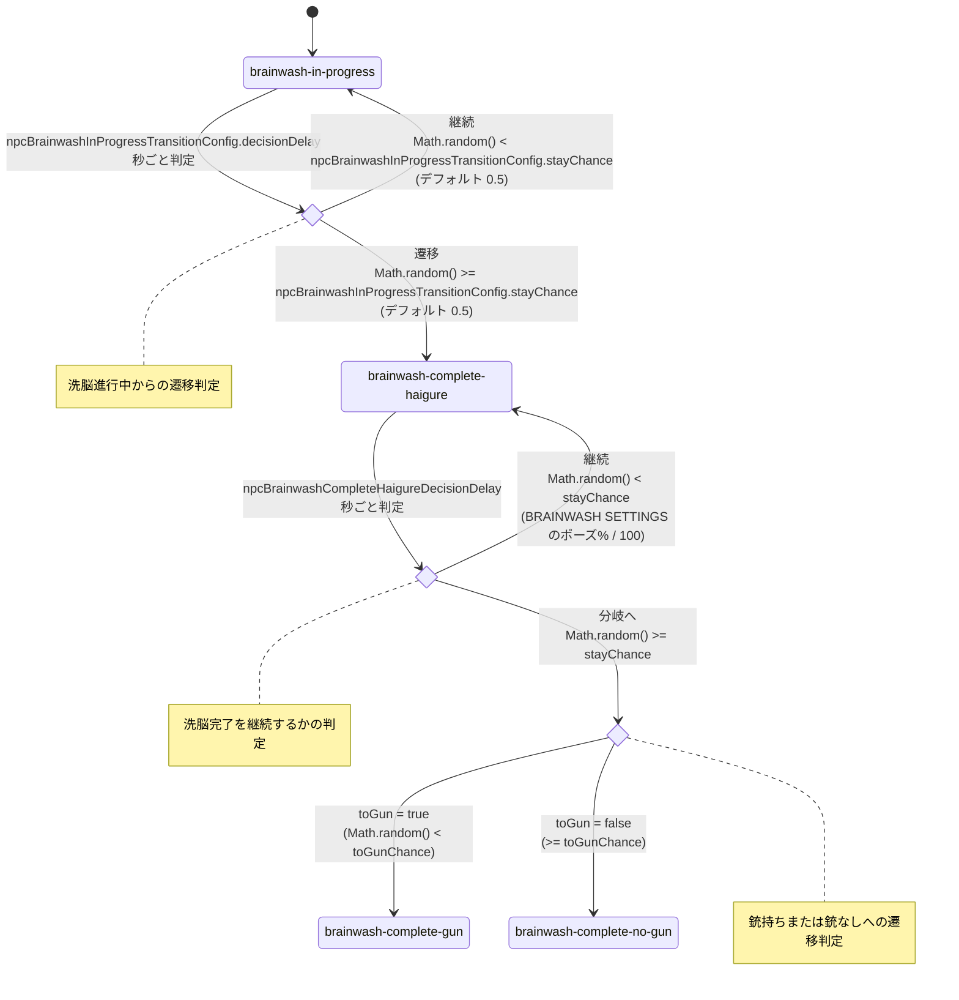

# HAIGURE SURVIVAL

ハイグレ洗脳されたい人向け一人称視点サバイバルゲームです。

ソースコードのみ配布しています。  
ゲームはウェブブラウザ上で起動します（推奨：Google Chrome）。起動方法は「必須手順」を参照してください。  
各種素材は各自でご用意ください。導入方法は「任意手順」を参照してください。  
Windows向けexeの作成手順は「任意手順（Windows向けexeをビルドする）」を参照してください。  

バグ報告、機能追加提案などがありましたらissueを立ててください。

## 起動準備

### 必須手順（ゲームをブラウザで起動するまで）
1. Node.js 18 以上（npm 同梱）をインストールする。
   - 公式サイト（https://nodejs.org/ ）から LTS をダウンロードして実行する。
   - 画面の指示に従ってインストールを完了する。
   - 既にインストール済みであれば、この手順はスキップしてよい。
2. このリポジトリのソースコードをダウンロードし、解凍する。
   - GitHub画面内の`Code`ボタン → `Download ZIP`ボタンでダウンロード可能。gitコマンドが使えるなら`git clone`でも可
   - フォルダごと任意の場所へコピーする。
   - 例: `D:\games\haigure_survival-main`
3. ターミナルを開き、プロジェクトフォルダへ移動する。
   - Windows の場合: PowerShell を開き、移動コマンドを実行。
     例: `cd D:\games\haigure_survival-main`
   - mac の場合: ターミナルを開き、移動コマンドを実行。
     例: `cd /Users/<ユーザー名>/games/haigure_survival-main`
4. 依存関係をインストールする。
   - `npm install` コマンドを実行する。
   - インストールに成功していても、何らかの注意文が表示されることがあります。明らかなエラーではない限り、一旦次に進んでみてください。
   - 【Windows, PowerShell】エラー`npm : このシステムではスクリプトの実行が無効になっているため、ファイル ～ を読み込むことができません。`が発生したら
     - スクリプトの実行ポリシーを一時的に変更すると解決するかもしれません。
     - 変更コマンド例：`Set-ExecutionPolicy -ExecutionPolicy RemoteSigned -Scope Process`
5. 開発用のサーバーを起動する。
   - `npm run dev` コマンドを実行する。
6. ブラウザで以下の動作確認用URLにアクセスする。
   - http://localhost:5175
7. ゲーム終了時には、開発用のサーバーを停止する。
   - PowerShellまたはターミナルで `Ctrl + C`

#### その他、エラーやトラブルが発生したら

上記の「必須手順」は、あくまで一般的なNode.jsおよびnpmのインストール手順です。本ゲーム特有の手順はほとんどありません。  
表示されたエラー文や実行したコマンド等でググる、またはAIに質問すればほぼ確実に解決方法にたどり着けるはずです。  

なお、香取犬は起動準備に関してのサポートやトラブルの対応はいたしかねますのでご了承ください。  

### 任意手順（Windows向けexeをビルドする）
1. `npm run dist` を実行する。
2. `release/` に以下の成果物が作成される。
   - `HAIGURE SURVIVAL-<version>-portable.exe`
   - 以前のバージョンで作られた成果物（例: `Setup.exe`）が残っている場合は、そのまま同じフォルダに残るため不要なら手動で削除する。
3. 配布時は `*-portable.exe` をそのまま渡せる。
4. 受け取り側は、exeと同階層に `assets/` を作成して素材を配置する（必要な構成は「素材用フォルダ構成」を参照）。
5. この形式はインストーラーを使わないため、レジストリを汚さずに運用できる。
6. 削除時はexeと `assets/` を通常のファイル削除で消せばよい。

### 任意手順（準備した素材をゲームに読み込ませるには）

> [!IMPORTANT]  
> **以下は `ver2.x.x` 以上用の手順です。**  
> `ver1.x.x` をご利用の方は[こちらのリンク先](https://github.com/catoriinu/haigure_survival/blob/a473e759fe35c18b59f2d26fa9a952d67955f999/README.md#%E4%BB%BB%E6%84%8F%E6%89%8B%E9%A0%86%E6%BA%96%E5%82%99%E3%81%97%E3%81%9F%E7%B4%A0%E6%9D%90%E3%82%92%E3%82%B2%E3%83%BC%E3%83%A0%E3%81%AB%E8%AA%AD%E3%81%BF%E8%BE%BC%E3%81%BE%E3%81%9B%E3%82%8B%E3%81%AB%E3%81%AF)
で手順をご参照ください。

#### 素材用フォルダ構成
- サーバ起動時はプロジェクト同階層、exe版はexe同階層に `assets/` を配置し、その配下に素材を置く。
  - フォルダ構成:
    ```
    assets/
    ├─ config/
    │  └─ game-config.json
    ├─ audio/
    │  ├─ bgm/
    │  ├─ se/
    │  └─ voice/
    ├─ picture/
    │  └─ chara/
    └─ stage/
    ```
  - 空フォルダ維持用の `.gitkeep` は、実装側で素材として読み込まれない。
  - `assets/config/game-config.json` に、ステージ一覧・BGM/SE/VOICEを記述する。
  - キャラクターフォルダ名の命名規則（実装準拠）:
    - `assets/picture/chara/` は先頭2文字が音声ID（2桁）と一致するフォルダだけが優先割り当て対象（例: `05_big_sister`）。一致させない場合は任意名でよい。
    - `assets/audio/voice/` はフォルダ名を参照しないため任意（管理上は「2桁ID + 任意文字列」にしておくと分かりやすい）。
    - `assets/audio/bgm/` / `assets/audio/se/` / `assets/stage/` はキャラクターフォルダ不要。

#### game-config.json（version: 2.0.0時点）
- `version`（文字列）
  - `game-config.json` の版数を記録するための値。
  - このREADMEの手順は `2.0.0` を前提にしている。
- `stageCatalog`（配列）
  - ステージ一覧を決める設定。
  - 要素ごとに `{ id, label, jsonFile }` を指定する。
  - `id`: ステージの管理用ID（重複しない値を使う）。
  - `label`: ステージ名として表示したい文字列。
  - `jsonFile`: `assets/stage/` 配下のステージJSONファイル名（例: `laboratory.json`）。
  - 最初の要素（先頭）が初期ステージとして使われる。
- `audio.bgm` と `audio.se` の詳細は後述のセクションを参照。

#### BGM
- `assets/audio/bgm/` に `mp3` を配置する。
- `assets/config/game-config.json` の `audio.bgm` で再生ルールを設定する。
  - `byStage`: ステージごとのBGM指定（キーは `stageCatalog` の `id`、値はファイル名）。
- まず動かす最小設定:
  - `assets/audio/bgm/` に1曲以上置く。
  - `byStage` はそのまま使う（ファイルがあるステージは固定再生、ないステージはランダム再生）。
- ステージごとに分けたい場合:
  - `byStage` に `"<ステージ識別名>": "<ファイル名>"` を追加する。
  - 例: `"laboratory": "laboratory.mp3"`
- 注意:
  - `byStage` の指定ファイルがないステージは、`assets/audio/bgm/` 内の実在ファイルからランダム再生される。
  - `assets/audio/bgm/` に `mp3` が1つもない場合はBGMは再生されない。

#### SE
- `assets/audio/se/` に `mp3` を配置する。
- `assets/config/game-config.json` の `audio.se` に「ファイル名のみ」を設定する（フォルダ名は不要）。
- 設定例（値は用途説明の例。実際は手元のファイル名に置き換える）:
  ```json
  "se": {
    "bitMove": "ビットが浮遊しているときのSE.mp3",
    "bitAlert": "ビットが警告状態のときのSE.mp3",
    "bitTarget": "ビットが狙いを定めたときのSE.mp3",
    "alarm": "アラーム発動時のSE.mp3",
    "beamNonTarget": [
      "ビーム発射SE_非ターゲット時_遠距離(10セル以上).mp3",
      "ビーム発射SE_非ターゲット時_中距離(5セル以上10セル未満).mp3",
      "ビーム発射SE_非ターゲット時_近距離(5セル未満).mp3"
    ],
    "beamTarget": [
      "ビーム発射SE_ターゲット時_遠距離(10セル以上).mp3",
      "ビーム発射SE_ターゲット時_中距離(5セル以上10セル未満).mp3",
      "ビーム発射SE_ターゲット時_近距離(5セル未満).mp3"
    ],
    "hit": [
      "ビーム命中時のSE(複数設定してある場合はランダム再生).mp3"
    ]
  }
  ```
- `beamNonTarget` / `beamTarget` を1種類だけ使う場合は、同じファイル名を3回書いてよい。
- プレイヤーを狙って発射した場合は `beamTarget`、それ以外（トラップ発射・プレイヤー発射・NPCの非プレイヤー狙い発射など）は `beamNonTarget` が使われる。
- `audio.se` に書いたファイルが `assets/audio/se/` に存在しない場合、そのSEは再生されない。

#### VOICE
- `assets/config/game-config.json` の `audio.voiceManifest` には、VOICEマニフェストJSONへの相対パスを指定する（例: `"audio/voice/voice-manifest.json"`）
- `assets/audio/voice/` 配下に音声ファイル（`wav` など）を配置し、`voice-manifest.json` に登録する。
- `voice-manifest.json` の基本ルール:
  - 最上位キー: キャラクターID（`"01"` のような2桁ID推奨）
  - 各ID配下に、後述の設定例に含まれるキーをすべて用意する。  
    - `brainwash-complete-haigure` だけはオブジェクト形式で `enter` / `loop` を持つ。
    - それ以外のキーは文字列配列（ファイルパスの配列）で指定する。
  - パスは `assets/audio/voice/` からの相対パスで書く（例: `01_devil/voice_a.wav`）。
  - そのカテゴリを鳴らさない場合は空配列 `[]` を指定する。
- 設定例:
  ```json
  {
    "01": {
      "normal": ["01_devil/通常ボイス.wav"],
      "evade": ["01_devil/回避ボイス.wav"],
      "hit-a": ["01_devil/被弾ボイス.wav"],
      "hit-b": [],
      "brainwash-in-progress": ["01_devil/洗脳進行中のハイグレボイス.wav"],
      "brainwash-complete-gun": ["01_devil/洗脳完了_銃ありに遷移時ボイス.wav"],
      "brainwash-complete-no-gun": ["01_devil/洗脳完了_銃ありに遷移時ボイス.wav"],
      "brainwash-complete-haigure": {
        "enter": ["01_devil/洗脳完了宣言ボイス.wav"],
        "loop": ["01_devil/洗脳完了後のハイグレボイス.wav"]
      },
      "brainwash-complete-haigure-formation": ["01_devil/整列時のハイグレボイス.wav"]
    }
  }
  ```

#### キャラクター画像
- キャラクター画像（立ち絵）を差し替える場合は、`assets/picture/chara/<キャラディレクトリ>/` に配置する（形式: `png`/`jpg`/`jpeg`/`webp`/`gif`/`bmp`/`avif`/`svg`）。
  - ファイル名は以下の8種類を用意する。
    - `normal`（通常：普段着）
    - `evade`（敵にターゲッティングされ、逃げている状態：普段着）
    - `hit-a`（光線命中：ハイレグ姿）
    - `hit-b`（光線命中：普段着）
    - `bw-in-progress`（洗脳進行中：ハイレグ姿）
    - `bw-complete-gun`（洗脳完了、光線銃を持ち未洗脳者を狙う：ハイレグ姿）
    - `bw-complete-no-gun`（洗脳完了、光線銃なしで未洗脳者を捕獲しようとする：ハイレグ姿）
    - `bw-complete-pose`（洗脳完了、ハイグレポーズ：ハイレグ姿）
  - 例: `assets/picture/chara/05_big_sister/normal.png`
  - 画像は、1セル×2セルの表示枠に収まるよう、縦横比を保って自動で拡大/縮小される。
  - キャラフォルダ名の先頭2文字（2桁ID）が音声IDと一致する場合、そのIDのキャラ1人だけに優先して割り当てられる。
  - 優先割り当てされなかったキャラは、`assets/picture/chara/` 配下からランダムに割り当てられる（同じフォルダの重複利用あり）。

## 調整可能項目

### ゲーム全体の設定
- `src/main.ts`: `defaultDefaultStartSettings.initialNpcCount`（ステージ開始時のNPC人数。0〜99。デフォルトは11）
- `src/main.ts`: `minimapReadoutVisible`（ミニマップ座標表示ボックスの表示切替。true=表示、false=非表示（デフォルト））
- `src/game/characterSprites.ts`: `PLAYER_EYE_HEIGHT`（プレイヤーのカメラの高さ。係数が大きいほど高くなる。デフォルトは`PLAYER_SPRITE_HEIGHT * 0.75`）

### ビット関連の設定
- `src/main.ts`: `redBitSpawnChance`（赤ビット（通常の3倍の性能を持つビット）の出現確率。0-1の確率で判定し、デフォルトは0.05）
- `src/main.ts`: `defaultBitSpawnSettings.bitSpawnInterval`（ビットの通常出現間隔。1〜99秒。デフォルトは10秒）
- `src/main.ts`: `defaultBitSpawnSettings.maxBitCount`（ビットの同時出現上限。1〜99。デフォルトは25）
- `src/main.ts`: `defaultBitSpawnSettings.disableBitSpawn`（`ビットを出現させない`チェックの初期値。`true`でビットを一切出現させない。デフォルトは`false`）
- `src/game/bits.ts`: `bitModeMuzzleColorEnabled`（ビットの先端球のモード別色変更。true=モードに応じて色が変わる、false=初期色のまま固定（デフォルト））

### プレイヤー、NPCの光線命中時の設定
- `src/main.ts`: `playerHitDuration`（プレイヤーが光線命中後に点滅状態を繰り返す継続時間（秒）。デフォルトは3）
- `src/game/npcs.ts`: `npcHitDuration`（NPCが光線命中後に点滅状態を繰り返す継続時間（秒）。デフォルトは3）
- `src/main.ts`: `playerHitFadeDuration`（プレイヤーの点滅状態後、`hit-a`（光線命中：ハイレグ姿）のまま光がフェードする時間（秒）。デフォルトは1）
- `src/game/npcs.ts`: `npcHitFadeDuration`（NPCの点滅状態後、`hit-a`（光線命中：ハイレグ姿）のまま光がフェードする時間（秒）。デフォルトは1）
- `src/main.ts`: `playerHitFlickerInterval`（プレイヤー光線命中時の光の点滅の切り替え間隔（秒）。小さくしすぎると光の刺激が強いため要注意。デフォルトは0.12）
- `src/game/npcs.ts`: `npcHitFlickerInterval`（NPC光線命中時の光の点滅の切り替え間隔（秒）。小さくしすぎると光の刺激が強いため要注意。デフォルトは0.12）
- `src/main.ts`: `defaultBrainwashSettings.brainwashOnNoGunTouch`（`BRAINWASH SETTINGS` の `銃なしに触れたら洗脳` チェック初期値。デフォルトは`false`）
- `src/game/npcs.ts`: `noGunTouchBrainwashDuration`（`銃なしに触れたら洗脳` ON時の接触洗脳演出時間（秒）。デフォルトは4）
- `src/game/portraitSprites.ts`: `noGunTouchBrainwashBlendStepCount`（`銃なしに触れたら洗脳` 演出の `hit-b`→`hit-a` 切り替え段階数。値を上げるほど切り替わりは滑らかになるが、起動時の読み込み時間は長くなる。デフォルトは16）

### NPCの洗脳後の状態遷移の設定
- `src/game/npcs.ts`: `npcBrainwashInProgressTransitionConfig.decisionDelay`（`brainwash-in-progress` の遷移判定を行う間隔（秒）。デフォルトは10。「洗脳進行中を経ずに即洗脳」ON時は強制的に0となる）
- `src/game/npcs.ts`: `npcBrainwashInProgressTransitionConfig.stayChance`（`brainwash-in-progress` の判定時に同状態を継続する確率。`1 - npcBrainwashInProgressTransitionConfig.stayChance` の確率で `brainwash-complete-haigure` へ遷移。デフォルトは0.5。「洗脳進行中を経ずに即洗脳」ON時は強制的に0となる）
- `src/game/npcs.ts`: `npcBrainwashCompleteHaigureDecisionDelay`（`brainwash-complete-haigure` から次状態への遷移判定間隔（秒）。デフォルトは10）

#### 遷移図


### トラップルーム用設定
- `src/game/trap/system.ts`: `trapInitialVolleyCount`（トラップ光線の初回値。`1`なら回を追うごとに`1,3,6,10,15...`と増加していく。デフォルトは`1`）
- `src/game/trap/system.ts`: `trapWallSelectionWeight`（発射セル抽選で壁セルに掛ける重み。床セルの重みは常に`1`。値を小さくするほど壁が選ばれにくくなり、`0`で壁は抽選対象外。デフォルトは`0.5`）

### アラームセル用設定
- `src/game/alarm/system.ts`: `alarmSelectionInterval`（アラームセルを追加抽選する間隔（秒）。デフォルトは`5`）
- `src/game/alarm/system.ts`: `alarmInfluenceRadiusCells`（アラーム発動時に強制追跡対象とする洗脳済みNPCの判定半径（セル数）。`layout.cellSize * alarmInfluenceRadiusCells` の平面距離で判定。デフォルトは`50`）
