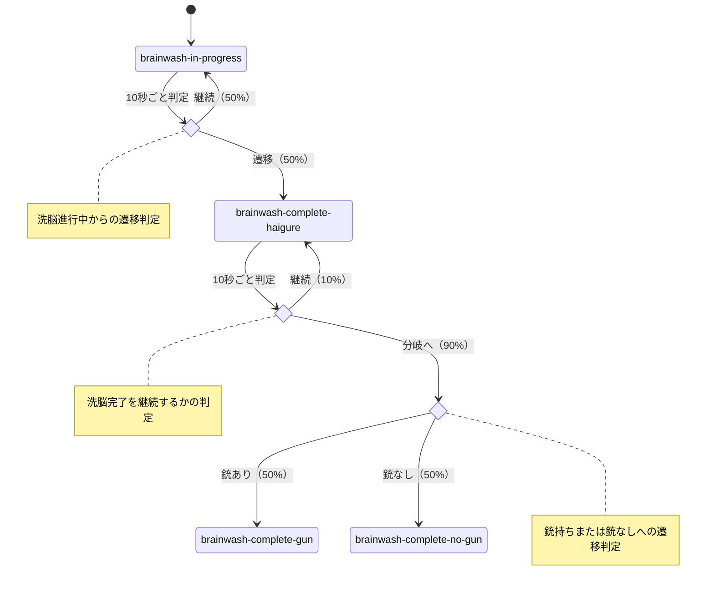

# HAIGURE SURVIVAL V2

ハイグレ洗脳されたい人向け一人称視点サバイバルゲームです。

V2では学校を舞台にした3Dステージでのサバイバルをお楽しみいただけます。机や椅子が散乱した侵略初期の雰囲気を再現しています。  
窓をすり抜ける光線や、扉・階段・エレベーターを使った立体的な攻防戦に加え、ミッション、仲間の同行・共闘、全校放送などの新機能をお楽しみください。  

ソースコードのみ配布しています。  
ゲームはウェブブラウザ上で起動します（推奨：Google Chrome）。ローカルでの起動方法は「[必須手順](#必須手順ゲームをブラウザで起動するまで)」を参照してください。  
各種素材は各自でご用意ください。導入方法は「[任意手順](#任意手順準備した素材をゲームに読み込ませるには)」を参照してください。  

バグ報告、機能追加提案などがありましたらissueを立ててください。

## ブラウザゲーム版（V2）

**https://catoriinu.itch.io/haigure-survival-v2**

パスワード：ローマ字風7文字（ヒントはゲームのタイトル）

ブラウザゲーム版では無料・事前準備不要でゲームをプレイすることができます。  
ただしSE以外は無音、NPCもデフォルトのままです。  

## V1とV2の違い

V1は、シンプルなモデルの3Dマップを舞台にしたゲームで、複数のステージやさまざまなギミックを楽しめます。

V1が遊びたい方は、[こちらのページ（最新版はv1.3.1）](https://github.com/catoriinu/haigure_survival/releases/tag/v1.3.1)からダウンロードしてください。

ブラウザゲーム版（V1）： **https://catoriinu.itch.io/haigure-survival**

パスワード：ローマ字風7文字（ヒントはゲームのタイトル）

## 起動準備

### 必須手順（ゲームをブラウザで起動するまで）
1. Node.jsの最新LTS版（npm 同梱）をインストールする。
   - 公式サイト（https://nodejs.org/ ）から LTS をダウンロードして実行する。
   - 画面の指示に従ってインストールを完了する。
   - 既に最新LTS版をインストール済みであれば、この手順はスキップしてよい。
2. このリポジトリのソースコードをダウンロードし、解凍する。
   - GitHub画面内の`Code`ボタン → `Download ZIP`ボタンでダウンロード可能。gitコマンドが使えるなら`git clone`でも可
   - フォルダごと任意の場所へコピーする。
   - 例: `D:\games\haigure_survival-main`
3. ターミナルを開き、プロジェクトフォルダへ移動する。
   - Windows の場合: PowerShell を開き、移動コマンドを実行。
     例: `cd D:\games\haigure_survival-main`
   - mac の場合: ターミナルを開き、移動コマンドを実行。
     例: `cd /Users/<ユーザー名>/games/haigure_survival-main`
4. 依存関係をインストールする。
   - `npm install` コマンドを実行する。
   - インストールに成功していても、何らかの注意文が表示されることがあります。明らかなエラーではない限り、一旦次に進んでみてください。
   - 【Windows, PowerShell】エラー`npm : このシステムではスクリプトの実行が無効になっているため、ファイル ～ を読み込むことができません。`が発生したら
     - スクリプトの実行ポリシーを一時的に変更すると解決するかもしれません。
     - 変更コマンド例：`Set-ExecutionPolicy -ExecutionPolicy RemoteSigned -Scope Process`
5. 開発用のサーバーを起動する。
   - `npm run dev` コマンドを実行する。
6. ブラウザで以下の動作確認用URLにアクセスする。
   - [http://localhost:5175](http://localhost:5175)
7. ゲーム終了時には、開発用のサーバーを停止する。
   - PowerShellまたはターミナルで `Ctrl + C`

#### その他、エラーやトラブルが発生したら

上記の「必須手順」は、あくまで一般的なNode.jsおよびnpmのインストール手順です。本ゲーム特有の手順はほとんどありません。  
表示されたエラー文や実行したコマンド等でググる、またはAIに質問すればほぼ確実に解決方法にたどり着けるはずです。  

なお、香取犬は起動準備に関してのサポートやトラブルの対応はいたしかねますのでご了承ください。  

### 任意手順（準備した素材をゲームに読み込ませるには）

#### 素材用フォルダ構成
- `public/` 配下に各種素材を置くことができる。V1の音声・キャラクター画像は、ファイル名を変えずに同じ場所へ配置できる。
  - フォルダ構成:
    ```
    public/
    ├─ audio/
    │  ├─ bgm/
    │  ├─ se/
    │  └─ voice/
    ├─ picture/
    │  └─ chara/
    └─ stage-assets/  （同梱の3Dステージ資産）
    ```
  - キャラクターフォルダ名の命名規則（実装準拠）:
    - `public/picture/chara/` は先頭2文字が音声ID（2桁）と一致するフォルダだけが優先割り当て対象（例: `05_big_sister`）。一致させない場合は任意名でよい。
    - `public/audio/voice/` は再生時には登録パスを使うためフォルダ名は任意。自ボイスの選択肢に表示する場合は「2桁ID + 任意文字列」にする。
    - `public/audio/bgm/` / `public/audio/se/` / `public/stage-assets/` はキャラクターフォルダ不要。

#### BGM
- `public/audio/bgm/` に `mp3` を配置する。
  - ステージIDと同名の `<name>.mp3` があれば、それを優先再生する。
    - 例: 学校のステージIDは `school` なので、`public/audio/bgm/school.mp3` があれば優先する。
  - 一致するファイルがない場合は、`public/audio/bgm/` 内の `mp3` からランダム再生する。
  - `public/audio/bgm/` に `mp3` が一つもない場合は再生しない。

#### SE
- `public/audio/se/` に以下のファイル名で配置する（形式: `mp3`）。
  - ビットの浮遊音: `FlyingObject.mp3`
  - ビットの警告音: `BeamShot_WavingPart.mp3`
  - ビットが狙いを定める音: `aim.mp3`
  - ビームの発射音: `BeamShotR_DownLong.mp3` / `BeamShotR_Down.mp3` / `BeamShotR_DownShort.mp3` / `BeamShotR_Up.mp3` / `BeamShotR_UpShort.mp3` / `BeamShotR_UpHighShort.mp3`
  - ビームの命中音: `BeamHit_Rev.mp3` / `BeamHit_RevLong.mp3` / `BeamHit_RevLongFast.mp3`
  - アラーム発動音: `alarm.mp3`
  - ファイルが存在しない場合はエラー無しで再生しない。

#### VOICE
- `public/audio/voice/` 配下に `wav` を配置し、`src/audio/voiceManifest.json` にキャラクターIDと状態ごとの配列で登録する。
  - キャラクターフォルダ名は任意。自ボイスの選択肢に表示する場合は「2桁ID + 任意文字列」にする（例: `public/audio/voice/01_devil/`）。JSONのキーは2桁IDのみを使う（例: `"01"`）。
  - JSONのパスは `/audio/voice/` を省いた相対パスで記載する（例: `public/audio/voice/01_devil/悪_110ハイグレ.wav` → `01_devil/悪_110ハイグレ.wav`）。
  - 実装側で `/audio/voice/` を補完して再生する。
  - 状態ごとの配列が空、または項目が無い場合は無音でスキップする（フォールバックなし）。
  - `brainwash-complete-haigure` は `enter`（一回のみ）と `loop`（ループ）を分けて登録する。
  - JSON構成の例:
    ```json
    {
      "01": {
        "normal": ["01_devil/悪_Bいや….wav"],
        "evade": ["01_devil/悪_Bこ、こっち来ないで！.wav"],
        "hit-a": ["01_devil/悪_Cいやああああ！.wav"],
        "hit-b": [],
        "brainwash-in-progress": ["01_devil/悪_110ハイグレ.wav"],
        "brainwash-complete-gun": ["01_devil/悪_A洗脳完了よ！.wav"],
        "brainwash-complete-no-gun": ["01_devil/悪_A洗脳完了よ！.wav"],
        "brainwash-complete-haigure": {
          "enter": ["01_devil/悪_A洗脳完了よ！.wav"],
          "loop": ["01_devil/悪_410ハイグレ.wav"]
        },
        "brainwash-complete-haigure-formation": ["01_devil/悪_410ハイグレ揃.wav"]
      }
    }
    ```
  - 再生契機:
    - `normal`: 通常状態で一定時間経過するごとに再生。
    - `evade`: `evade` に遷移した瞬間に一回のみ再生。
    - `hit-a`: `hit-a` （光線命中状態、ハイレグ姿）に遷移した瞬間に一回のみ再生。
    - `hit-b`: 現状の実装ではVOICE再生に未使用。
    - `brainwash-in-progress`: `brainwash-in-progress` に遷移した瞬間からループ再生。
    - `brainwash-complete-gun` / `brainwash-complete-no-gun`: それぞれの状態で一定時間経過するごとに再生。
    - `brainwash-complete-haigure`: `enter` を一回のみ再生し、終了時も同状態なら `loop` をループ再生。
    - `brainwash-complete-haigure-formation`: その状態に遷移した瞬間からループ再生。

#### キャラクター画像
- キャラクター画像（立ち絵）を差し替える場合は、`public/picture/chara/<キャラディレクトリ>/` に配置する（形式: `png`/`jpg`/`jpeg`/`webp`/`gif`/`bmp`/`avif`/`svg`）。
  - ファイル名は以下の8種類を用意する。
    - `normal`（通常：普段着）
    - `evade`（敵にターゲッティングされ、逃げている状態：普段着）
    - `hit-a`（光線命中：ハイレグ姿）
    - `hit-b`（光線命中：普段着）
    - `bw-in-progress`（洗脳進行中：ハイレグ姿）
    - `bw-complete-gun`（洗脳完了、光線銃を持ち未洗脳者を狙う：ハイレグ姿）
    - `bw-complete-no-gun`（洗脳完了、光線銃なしで未洗脳者を捕獲しようとする：ハイレグ姿）
    - `bw-complete-pose`（洗脳完了、ハイグレポーズ：ハイレグ姿）
  - 例: `public/picture/chara/05_big_sister/normal.png`
  - 画像サイズは、横1:縦2の比率を基準とする。基準よりも長い辺がある場合はそれを基準に、画像比率を保って縮小する。
  - キャラディレクトリ名の先頭2文字（2桁ID）が音声IDと一致する場合は、そのIDに対して1キャラ分だけ優先割り当てする。
  - 画像の使い回しが発生する場合はランダム割り当てになり、同じIDが一致するかどうかは抽選結果次第（一致しても問題なし）。

## NPCの洗脳後の状態遷移

以下はデフォルト状態での状態遷移図です。タイトル画面の「洗脳」の設定で変更ができます。

```mermaid
stateDiagram-v2
    state "brainwash-in-progress" as brainwashInProgress
    state "brainwash-complete-haigure" as brainwashCompleteHaigure
    state "brainwash-complete-gun" as brainwashCompleteGun
    state "brainwash-complete-no-gun" as brainwashCompleteNoGun

    state inProgressDecision <<choice>>
    state haigureStayDecision <<choice>>
    state gunNoGunDecision <<choice>>

    note right of inProgressDecision
      洗脳進行中からの遷移判定
    end note
    note right of haigureStayDecision
      洗脳完了を継続するかの判定
    end note
    note right of gunNoGunDecision
      銃持ちまたは銃なしへの遷移判定
    end note

    [*] --> brainwashInProgress

    brainwashInProgress --> inProgressDecision: 10秒ごと判定
    inProgressDecision --> brainwashInProgress: 継続（50%）
    inProgressDecision --> brainwashCompleteHaigure: 遷移（50%）

    brainwashCompleteHaigure --> haigureStayDecision: 10秒ごと判定
    haigureStayDecision --> brainwashCompleteHaigure: 継続（10%）
    haigureStayDecision --> gunNoGunDecision: 分岐へ（90%）
    gunNoGunDecision --> brainwashCompleteGun: 銃あり（50%）
    gunNoGunDecision --> brainwashCompleteNoGun: 銃なし（50%）
```

## 制作者用メモ：HTML5ゲームとしてのビルド手順
1. `public/` 配下には配布してよい素材だけを置き、配布したくない素材ファイルを退避する。
   - 配置したファイルは、同じフォルダ構成・ファイル名で配布物に含まれる。音声・キャラクター画像を置かなくてもビルド・プレイできる。
   - ブラウザゲーム版はSEだけを置いてビルドする。BGM・VOICE・キャラクター画像は置かない。
   - 同梱の `stage-assets/` と `LICENSES/` はそのまま残す。
2. 配布用ビルドを作成する。
   - `npm run build:renderer`
3. dist配下の成果物を `index.html` がZIP直下になる形で圧縮する。
