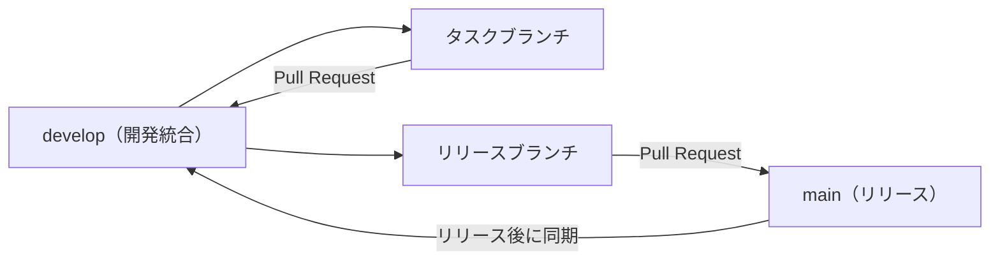

# HAIGURE SURVIVAL ブランチ戦略

更新日: 2026-08-08

## 1. 目的

本書は、通常開発とバージョンアップを複数のCodexセッションで安全に進めるためのブランチ運用を定義する。HAIGURE SURVIVAL v2のT系・B系タスクは、すべて本書に従う。

## 2. ブランチ構成



### `main`

- リリース可能な状態だけを保持する。
- 通常開発や未完成機能を直接コミットしない。
- 直接pushせず、リリースブランチからのPull Requestで更新する。

### `develop`

- 開発中の変更を統合する基準ブランチとする。
- v2完成前の未完成状態や既知の不具合を含むことを許容する。
- T系・B系タスクを直接コミットせず、タスクブランチからのPull Requestで取り込む。
- 次の依存タスクは、前のタスクが`develop`へマージされた後の最新状態から開始する。

### タスクブランチ

- 必ず最新の`develop`から作成する。
- 1つのT系・B系タスクにつき1ブランチを使用する。
- Codexが作成するブランチ名は`codex/`で始める。
- 対象タスク以外の実装へ進まない。
- タスク完了後はoriginへpushし、`develop`宛てのPull Requestを作成する。

推奨ブランチ名:

| タスク | ブランチ名 |
|---|---|
| T00 | `codex/v2-t00-roadmap` |
| T01 | `codex/v2-t01-glb-contract` |
| T02 | `codex/v2-t02-stage-loader` |
| T03 | `codex/v2-t03-player-height` |
| T04 | `codex/v2-t04-navigation-npc` |
| T05-1（A／B統合） | `codex/v2-t05-bit-flight-navigation` |
| T05-2 | `codex/v2-t05-combat-systems` |
| T05-2V | `codex/v2-t05-2v-beam-effects` |
| T05-4 | `codex/v2-t05-4-target-selection` |
| B01 | `codex/v2-b01-school-layout` |
| B02 | `codex/v2-b02-school-blockout` |
| B03 | `codex/v2-b03-school-lowpoly` |
| B04 | `codex/v2-b04-school-world-boundary` |
| T06-1 | `codex/v2-t06-runtime-core` |
| T06-2 | `codex/v2-t06-school-integration` |
| I2 | `codex/v2-map-mission-design` |
| T06-3 | `codex/v2-minimap` |
| B05 | `codex/v2-mission-locations` |
| T06-4 | `codex/v2-missions` |
| I3 | `codex/v2-character-display-design` |
| T06-5 | `codex/v2-character-portraits` |
| T07 | `codex/v2-t07-regression-docs` |

PR #41以降は、レビュー可能な一ブランチ単位へ次のように分割する。

| 作業単位 | ブランチ名 |
|---|---|
| B03-0 設計確定 | `codex/v2-b03-design-freeze` |
| T04-2A 高さ付きNav基盤 | `codex/v2-t04-height-nav-core` |
| B03-1 建築仕上げ | `codex/v2-b03-architecture` |
| B03-2 内装・最適化 | `codex/v2-b03-interiors` |
| T04-2B 学校複数階統合 | `codex/v2-t04-school-multifloor` |
| T05-1 汎用飛行帯ナビゲーション・飛行安全 | `codex/v2-t05-bit-flight-navigation` |
| T05-2 戦闘システム | `codex/v2-t05-combat-systems` |
| B03-3A 学校拡張設計確定 | `codex/v2-plan-world-boundary-roadmap` |
| T05-2V 光線演出・世界境界終了 | `codex/v2-t05-2v-beam-effects` |
| B03-3B 学校拡張構造資産 | `codex/v2-b03-3-structure` |
| B03-3C 動的学校アセット | `codex/v2-b03-3-interactive-assets` |
| T04-3A 動的空間基盤 | `codex/v2-t04-3-dynamic-runtime` |
| T05-3 同陣営NPC指示 | `codex/v2-t05-3-npc-commands` |
| B04 学校外周・道路・世界境界資産 | `codex/v2-b04-school-world-boundary` |
| T05-4 NPC・BIT標的選択個性 | `codex/v2-t05-4-target-selection` |
| T04-3B 実学校動的統合 | `codex/v2-t04-3-school-integration` |
| I1 Wave 0Gロードマップ再編 | `codex/v2-wave-0g-roadmap` |
| B03-3D 荒れ版教室配置 | `codex/v2-b03-3-disordered-classrooms` |
| B03-3D追補 | `codex/v2-b03-3d-furniture-overlap` |
| T06-1 通常ゲームRuntime接続 | `codex/v2-t06-runtime-core` |
| T06-2 学校開始・出現・増援統合 | `codex/v2-t06-school-integration` |
| I2 ミニマップ・Mission設計 | `codex/v2-map-mission-design` |
| T06-3 ミニマップ | `codex/v2-minimap` |
| B05 Mission Location資産 | `codex/v2-mission-locations` |
| T06-4 Mission Runtime | `codex/v2-missions` |
| I3 キャラクター反射・表示仕上げ設計 | `codex/v2-character-display-design` |
| T06-5 キャラクター反射・表示仕上げRuntime | `codex/v2-character-portraits` |
| T07 性能・回帰・仕様書 | `codex/v2-t07-regression-docs` |

PR #50までの実行順は、B03-0とT04-2Aの並行Wave、B03-1、B03-2、T04-2B、T05-1、T05-2で完了した。その後、B03-3Aで学校拡張契約を確定し、B03-3BとT05-2V、B03-3C・T04-3A・T05-3のI0統合、B04とT05-4の並行Wave、T04-3B、通常版教室配置、通常テスト人口更新、B03-3D、T06-1、B03-3D追補まで完了した。PR #66は`cdb8bae`で`develop`へ統合済みであり、現在はT06-2の計画開始・視覚承認フェーズである。その後はI2、T06-3とB05、T06-4、I3、T06-5、T07の順に実施する。

2026-07-26、`codex/v2-t05-combat-systems`はPR #50のマージコミット`27abd9b`で`develop`へ統合済みである。戦闘・状態・光線物理・集合・警報・公開処刑、Alert最大4機、BIT探索分散、窓越しCHASE、仕様維持性能リファクタリングをT05-2の完了範囲とする。V1相当の光線軌跡・周囲光球・着弾・キャラクター命中演出はPR #50へ追加せず、世界境界終了とともにT05-2Vへ分割する。

2026-08-01、PR #59のT04-3B、PR #60の通常版教室配置、PR #61の通常テスト人口50／10／20は`develop`の`e8f922d`までに統合済みである。B04の最終契約は`worldBoundaryMode = "required"`、非nullの`StageSpatialContext.worldBoundary`、外周BIT飛行帯なし、外周BIT経路0件を維持する。現在は`codex/v2-wave-0g-roadmap`で文書だけを再編し、コード・学校バイナリ・既存worktreeを変更しない。

T04-2BでB03-2統合後の階段NAV元形状と上階blockerを修正する作業だけは、`codex/v2-t04-school-multifloor`からローカル限定の`codex/v2-t04-school-nav-asset-fix`を分岐する。修正コミットはT04-2Bへ`--no-ff`でローカルマージし、この補助ブランチ自体はpushまたはPull Request化しない。2026-07-20に北西階段・吹抜け補正`1f34fe2`を`d9a3872`、北東・南西1F踊り場開口補正`fb2caf5`を`b3f2302`、上階Nav blocker補正`c2bcdcc`を`b5e77f7`としてT04へローカルマージ済みである。

2026-07-21の人間受入デザイン修正も同じ単一編集規則を適用し、T04からローカル限定の`codex/v2-t04-school-acceptance-fix`を分岐した。修正コミット`dcf1b66`はmerge commit `2f30a15`でT04へ`--no-ff`ローカルマージ済みである。補助ブランチは最終検証後もローカルに保持し、補助ブランチとT04本体のpush／Pull Request作成は別途指示があるまで行わない。

### リリースブランチ

- v2に必要なタスクが`develop`へ揃い、リリース準備を始める時点で`develop`から作成する。
- Codexが作成する場合は`codex/release-v2.0.0`のように命名する。
- バージョン更新、リリース向け文書、最終調整、ビルド確認だけを行う。
- 検証後、`main`宛てのPull Requestを作成してマージする。
- `main`更新後は、`main`から`develop`への同期Pull Requestを作成し、リリース時の変更を`develop`へ戻す。

## 3. タスク開始手順

1. `docs/plan.md`、`docs/plans/v2/next_tasks_plan.md`、対象の`docs/plans/v2/<タスクID>/plan.md`、本書を読む。
2. `git status`で未コミット変更がないことを確認する。
3. `develop`へ切り替え、originの最新`develop`を取り込む。
4. 対象タスク専用の`codex/v2-<タスク名>`ブランチを作成する。
5. 個別計画の対象範囲だけを実装する。

B03-0を開始する場合は、手順1で`docs/plans/v2/T04/plan.md`の「B03-0へのビット通過窓・屋上接近引き渡し契約」も必ず読み、ビット通過窓と屋上接近用固定経路の設計条件を確認する。

依存タスクが未マージの場合は、そのタスクのブランチから派生させず、依存タスクが`develop`へマージされるまで開始しない。

## 4. Pull Request規則

- T系・B系タスクは規模にかかわらず、原則としてすべて`develop`宛てのPull Requestを作成する。
- Pull RequestにはタスクID、目的、主な変更、検証結果、既知の未完成事項、個別計画へのパスを記載する。
- 対象タスクの完了条件と必要なビルド・テストを満たしてから作成する。
- `develop`全体がリリース可能であることは要求しないが、そのタスクで変更した範囲は検証済みであることを要求する。
- I0、B04、T05-4、T04-3B、B03-3D、T06-1、T06-2、T06-3、B05、T06-4、T06-5、T07はPull Request作成後、`develop`へマージする前に`docs/plans/v2/next_tasks_plan.md`の対応する重点動作確認ゲートと独立レビューを完了する。
- 現在のリポジトリ履歴に合わせ、通常のPull Requestマージで履歴を残す。
- マージ後、不要になったタスクブランチは削除する。

### GitHub CLI事前確認

Codexセッションでコミット・push・Pull Request作成まで行うタスクは、実装開始時にGitHub CLIのPATHと認証を確認する。

```powershell
Get-Command gh -ErrorAction SilentlyContinue
gh --version
gh auth status
```

- VS CodeのGit BashとCodexが使用するPowerShellではPATHが異なる場合があるため、一方で`gh`が動くことをもう一方の確認として扱わない。
- Windowsで`Get-Command gh`が見つからない場合は、`C:\Program Files\GitHub CLI\gh.exe`の存在を確認し、存在する場合は絶対パスで実行してよい。
- Codex起動後にGitHub CLIをインストールした、またはPATHを変更した場合に限り、裸の`gh`コマンドへ新しいPATHを反映する手段としてCodexアプリの再起動を検討する。
- 絶対パスで`gh --version`と`gh auth status`が成功する場合、コミット・push・Pull Request作成のためだけにCodexアプリを再起動する必要はない。
- GitHubアプリ連携でPull Requestを作成する場合も、ローカルGit操作とフォールバックに備えて上記確認を行う。

## 5. 並行開発規則

- T02～T04は共通コードへの変更が重なるため、承認済みの並行Waveを除いて直列で`develop`へマージする。
- B01～B03は依存条件を満たし、T系タスクと共有コードまたは同一のBlender／GLB／NavMesh資産を編集しない場合に限り、T系タスクと並行できる。
- PR #41直後の当時のWaveではB03-0とT04-2Aだけを並行した。T04-2Aは学校`.blend`、GLB、NavMeshバイナリ、カタログハッシュを編集せず、このWaveは完了済みである。現行の並行規則は後述するB03-3以降の契約へ置換する。
- B03-1とB03-2は同じ学校`.blend`とGLBを順番に編集する。T04-2B、T05-1、T05-2までは直列実行済みである。
- T05-1は、任意のゾーン・帯を扱う共通型、帯別ビットNavMesh bundle、接続グラフ、非学校fixture、学校データ移行と、全ビットモード共通の3D高さ安全、V1飛行表現、探索・追跡、窓・階段・上下・境界遷移、遷移前のカーペット解除を単一成果として担当する。学校`.blend`、GLB、人間用NavMesh、ビット用NavMesh、カタログハッシュも同じブランチで確定する。
- T05-1の確定半径契約は、V1実形状・戦闘用被弾球0.44m＋安全余裕0.10m＝移動包絡0.54mとする。上下揺れは中心位置のSweepであり半径へ二重加算しない。現行片羽開放幅1.20mの58窓は両羽全開への資産再設計待ちにせず、同じT05-1担当が0.54m包絡で再検証する。
- `bit_window`58組は接続先ゾーン・帯を明示したビット専用`aperture`遷移へ移行する。既存`bit_roof`2組は資産・Runtime・監査から完全廃止し、4F屋外帯と屋上外周をつなぐ安全な`boundary`遷移へ置き換える。屋上はゲーム、索敵、経路、戦闘の対象から外さない。
- 連続的な上下・境界遷移は`VOL_*`の`bit_flight_transition` role、階段は`surface-route`、窓などの狭い通過箇所は`LNK_*`の`aperture`として表す。共通Runtimeは学校、階数、体育館、屋上などの名前で分岐しない。
- T05-2はT05-1の`develop`統合後に、gun所持NPC／プレイヤー・ビットの完成戦闘、全光線物理、集合、警報、公開処刑、性能改善を担当し、PR #50で完了した。校庭／体育館の集合・公開処刑会場は学校生成正本、`.blend`、GLB、カタログhashを同じT05-2ブランチで単一編集し、形状不変の両NavMeshを検証済みである。学校トラップと動的3Dマップビームは追加しない。
- B03-3Aは設計文書だけを所有し、学校バイナリとRuntimeコードを編集しない。`docs/plan.md`と`docs/plans/v2/next_tasks_plan.md`は統合担当だけが更新する。
- B03-3BとT05-2Vの並行Waveは完了し、それぞれPR #52とPR #53で`develop`へ統合済みである。
- B03-3C、T04-3A、T05-3を集約したI0は、第1重点動作確認と独立レビューを完了して`develop`へ統合済みである。
- B04は学校`.blend`、生成正本、GLB、両NavMesh、カタログhashの単一担当として、歩道・道路と新規`BND_WorldLimit`を追加し、資産特化ゲート後に`develop`へ統合済みである。最終契約では外周BIT飛行帯を設けず、`worldBoundaryMode = "required"`、非nullの`worldBoundary`、外周BIT経路0件を維持する。
- T05-4は標的選択個性型、決定的50%抽選、NPC／BITの自律visual標的選択、T05 fixtureを実装し、AI特化ゲート後に`develop`へ統合済みである。
- B04とT05-4の並行Wave、T04-3B、通常版教室配置、通常テスト人口更新は完了し、PR #59～#61で`develop`へ統合済みである。
- Wave 0G後のB03-3DとT06-1の並行Waveは完了し、PR #65とPR #64で`develop`へ統合済みである。PR #64内で両成果の初回横断統合も完了した。
- B03-3D追補はPR #66で`develop=cdb8bae`へ統合済みであり、同branchによる学校生成正本、`.blend`、GLB、Room Variant NavMesh、生成器、監査器、カタログhashの編集は完了した。
- T06-2は`cdb8bae`から`codex/v2-t06-school-integration`で単独開始済みである。開始フェーズでは計画8ファイルだけを更新し、資産編集前に開始候補、抽選方式、出現禁止Volume寸法、NPC／BIT出現Volume範囲をユーザー承認する。
- T06-2は複数開始地点、動的出現禁止、NPC／BIT出現、時間増援を実装し、既存学校機能を横断回帰して、Pull Requestの`develop`マージ前にV3学校基盤機能ゲートを完了する。外周BIT飛行帯、外周BIT経路、外周スポーンは追加しない。
- I2はT06-2後の相談専用タスクとし、階別地図、階段、Location、Mission候補・状態遷移・20秒付与率をユーザー承認で確定する。コード・資産は変更しない。
- T06-3とB05だけをI2確定後に並行できる。T06-3はRuntime UIを所有して学校バイナリを変更せず、B05は承認済みMission Locationの生成正本、`.blend`、GLB、NavMesh、カタログhashを単一編集する。
- T06-4はT06-3とB05が独立レビュー後に`develop`へ統合済みの最新headから単独開始し、プレイヤー／NPC Mission、seed付き20秒scheduler、HUDを統合してV3A機能ゲートを完了する。
- 現行V2には鏡または反射用カメラがないため、I3はT06-4後の「キャラクター反射・表示仕上げ設計」相談専用タスクとし、鏡反射、必要な一人称表示仕上げ、99 NPC性能条件をユーザー承認で確定する。コード・資産は変更しない。
- T06-5はI3確定後に単独で実施し、T06-1の基本Character画像表示を前提に、承認済みの鏡反射と表示仕上げだけを実装してV3B機能ゲートを完了する。音声・画像バイナリはGit管理対象へ追加しない。
- T07はT06-5後に単独で実施し、ミニマップ、Mission、基本Character画像、鏡反射を有効にした99 NPC／50 BITの性能・最終回帰・仕様書同期を行う。Pull Requestの`develop`マージ前に性能・リリースゲートを完了する。
- 現行順序は`T06-2 → I2 → T06-3 + B05（並行）→ T06-4 → I3 → T06-5 → T07 → v2リリース準備`とし、依存成果が`develop`へ入る前に後続ブランチを作成したり書込みを開始したりしない。
- `.blend`と`.glb`は同時に複数ブランチで編集しない。Blender資産は常に1ブランチ・1担当とする。
- 旧`codex/v2-post-pr66-roadmap` worktreeはdirty差分を保持したまま凍結し、T06-2開始フェーズでは`codex/v2-t06-school-integration`だけが対象の計画8ファイルを更新する。
- `docs/plan.md`と`docs/plans/v2/next_tasks_plan.md`は統合担当だけが更新する。
- Pull Request作成前に最新の`develop`を取り込み、競合と回帰を解消する。

## 6. Blenderバイナリ資産

- `.blend`と`.glb`は差分マージできないため、単一担当制を厳守する。
- 現在Git LFSは設定されていない。T01で実ファイル容量を確認し、最初のBlender資産を本格的に履歴へ追加する前にGit LFS導入の要否を判断する。
- バイナリ競合が発生した場合は自動マージせず、正本となる担当ブランチを明示して再出力する。

## 7. 禁止事項

- `main`への直接コミット・直接push
- T系・B系タスクの`develop`への直接コミット・直接push
- 未マージの依存タスクブランチから次のタスクブランチを作ること
- 1ブランチへ複数の独立タスクを混在させること
- 同一Blender資産を複数ブランチで並行編集すること
- リリースブランチで新規機能を追加すること
