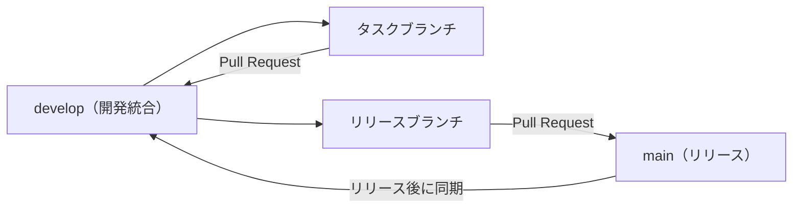

# HAIGURE SURVIVAL ブランチ戦略

更新日: 2026-07-19

## 1. 目的

本書は、通常開発とバージョンアップを複数のCodexセッションで安全に進めるためのブランチ運用を定義する。HAIGURE SURVIVAL v2のT系・B系タスクは、すべて本書に従う。

## 2. ブランチ構成



### `main`

- リリース可能な状態だけを保持する。
- 通常開発や未完成機能を直接コミットしない。
- 直接pushせず、リリースブランチからのPull Requestで更新する。

### `develop`

- 開発中の変更を統合する基準ブランチとする。
- v2完成前の未完成状態や既知の不具合を含むことを許容する。
- T系・B系タスクを直接コミットせず、タスクブランチからのPull Requestで取り込む。
- 次の依存タスクは、前のタスクが`develop`へマージされた後の最新状態から開始する。

### タスクブランチ

- 必ず最新の`develop`から作成する。
- 1つのT系・B系タスクにつき1ブランチを使用する。
- Codexが作成するブランチ名は`codex/`で始める。
- 対象タスク以外の実装へ進まない。
- タスク完了後はoriginへpushし、`develop`宛てのPull Requestを作成する。

推奨ブランチ名:

| タスク | ブランチ名 |
|---|---|
| T00 | `codex/v2-t00-roadmap` |
| T01 | `codex/v2-t01-glb-contract` |
| T02 | `codex/v2-t02-stage-loader` |
| T03 | `codex/v2-t03-player-height` |
| T04 | `codex/v2-t04-navigation-npc` |
| T05-1 | `codex/v2-t05-bit-flight-safety` |
| T05-2 | `codex/v2-t05-combat-systems` |
| B01 | `codex/v2-b01-school-layout` |
| B02 | `codex/v2-b02-school-blockout` |
| B03 | `codex/v2-b03-school-lowpoly` |
| T06 | `codex/v2-t06-school-integration` |
| T07 | `codex/v2-t07-regression-docs` |

PR #41以降は、レビュー可能な一ブランチ単位へ次のように分割する。

| 作業単位 | ブランチ名 |
|---|---|
| B03-0 設計確定 | `codex/v2-b03-design-freeze` |
| T04-2A 高さ付きNav基盤 | `codex/v2-t04-height-nav-core` |
| B03-1 建築仕上げ | `codex/v2-b03-architecture` |
| B03-2 内装・最適化 | `codex/v2-b03-interiors` |
| T04-2B 学校複数階統合 | `codex/v2-t04-school-multifloor` |
| T05-1 ビット飛行・高さ安全 | `codex/v2-t05-bit-flight-safety` |
| T05-2 戦闘システム | `codex/v2-t05-combat-systems` |

確定した実行順は、B03-0とT04-2Aの並行Wave、B03-1、B03-2、T04-2B、T05-1、T05-2、T06、T07とする。並行Wave以外は、直前の依存タスクが`develop`へマージされた後に開始する。

### リリースブランチ

- v2に必要なタスクが`develop`へ揃い、リリース準備を始める時点で`develop`から作成する。
- Codexが作成する場合は`codex/release-v2.0.0`のように命名する。
- バージョン更新、リリース向け文書、最終調整、ビルド確認だけを行う。
- 検証後、`main`宛てのPull Requestを作成してマージする。
- `main`更新後は、`main`から`develop`への同期Pull Requestを作成し、リリース時の変更を`develop`へ戻す。

## 3. タスク開始手順

1. `docs/plan.md`、`docs/plans/v2/next_tasks_plan.md`、対象の`docs/plans/v2/<タスクID>/plan.md`、本書を読む。
2. `git status`で未コミット変更がないことを確認する。
3. `develop`へ切り替え、originの最新`develop`を取り込む。
4. 対象タスク専用の`codex/v2-<タスク名>`ブランチを作成する。
5. 個別計画の対象範囲だけを実装する。

B03-0を開始する場合は、手順1で`docs/plans/v2/T04/plan.md`の「B03-0へのビット通過窓・屋上接近引き渡し契約」も必ず読み、ビット通過窓と屋上接近用固定経路の設計条件を確認する。

依存タスクが未マージの場合は、そのタスクのブランチから派生させず、依存タスクが`develop`へマージされるまで開始しない。

## 4. Pull Request規則

- T系・B系タスクは規模にかかわらず、原則としてすべて`develop`宛てのPull Requestを作成する。
- Pull RequestにはタスクID、目的、主な変更、検証結果、既知の未完成事項、個別計画へのパスを記載する。
- 対象タスクの完了条件と必要なビルド・テストを満たしてから作成する。
- `develop`全体がリリース可能であることは要求しないが、そのタスクで変更した範囲は検証済みであることを要求する。
- 現在のリポジトリ履歴に合わせ、通常のPull Requestマージで履歴を残す。
- マージ後、不要になったタスクブランチは削除する。

### GitHub CLI事前確認

Codexセッションでコミット・push・Pull Request作成まで行うタスクは、実装開始時にGitHub CLIのPATHと認証を確認する。

```powershell
Get-Command gh -ErrorAction SilentlyContinue
gh --version
gh auth status
```

- VS CodeのGit BashとCodexが使用するPowerShellではPATHが異なる場合があるため、一方で`gh`が動くことをもう一方の確認として扱わない。
- Windowsで`Get-Command gh`が見つからない場合は、`C:\Program Files\GitHub CLI\gh.exe`の存在を確認し、存在する場合は絶対パスで実行してよい。
- Codex起動後にGitHub CLIをインストールした、またはPATHを変更した場合に限り、裸の`gh`コマンドへ新しいPATHを反映する手段としてCodexアプリの再起動を検討する。
- 絶対パスで`gh --version`と`gh auth status`が成功する場合、コミット・push・Pull Request作成のためだけにCodexアプリを再起動する必要はない。
- GitHubアプリ連携でPull Requestを作成する場合も、ローカルGit操作とフォールバックに備えて上記確認を行う。

## 5. 並行開発規則

- T02～T04は共通コードへの変更が重なるため、承認済みの並行Waveを除いて直列で`develop`へマージする。
- B01～B03は依存条件を満たし、T系タスクと共有コードまたは同一のBlender／GLB／NavMesh資産を編集しない場合に限り、T系タスクと並行できる。
- PR #41以降はB03-0とT04-2Aだけを並行できる。T04-2Aは学校`.blend`、GLB、NavMeshバイナリ、カタログハッシュを編集しない。
- B03-1とB03-2は同じ学校`.blend`とGLBを順番に編集する。T04-2Bは両方の完了後に開始し、T05-1、T05-2、T06、T07はこの順で直列実行する。
- T05-1は全ビットモード共通の天井・屋外高さ安全、`bit_window`／`bit_roof`固定経路の実飛行、特殊接続前のカーペット解除だけを担当する。T05-2はT05-1完了後に、gun所持NPC・ビットの完成戦闘、全光線、集合、警報、公開処刑を担当する。
- `bit_window`と`bit_roof`は`LNK_<id>_A/B`で表し、`PRT_*`を使用しない。どちらもビット専用・双方向必須とする。屋上は窓の設置対象外であるだけで、ゲーム、索敵、経路、戦闘の対象から外さない。
- B03-1はB03-0で承認された窓開口、Collider、`LNK_*`と必要な意味Objectを学校資産へ追加し、B03-2はその名前・位置・開口寸法を維持する。T05-1とT05-2は学校`.blend`、GLB、NavMeshバイナリ、カタログハッシュを編集しない。
- 並行ブランチはそれぞれ最新の`develop`から作成し、別タスクブランチから派生させない。
- `.blend`と`.glb`は同時に複数ブランチで編集しない。Blender資産は常に1ブランチ・1担当とする。
- `docs/plan.md`は統合担当だけが更新し、並行担当は自分の個別計画を更新する。
- Pull Request作成前に最新の`develop`を取り込み、競合と回帰を解消する。

## 6. Blenderバイナリ資産

- `.blend`と`.glb`は差分マージできないため、単一担当制を厳守する。
- 現在Git LFSは設定されていない。T01で実ファイル容量を確認し、最初のBlender資産を本格的に履歴へ追加する前にGit LFS導入の要否を判断する。
- バイナリ競合が発生した場合は自動マージせず、正本となる担当ブランチを明示して再出力する。

## 7. 禁止事項

- `main`への直接コミット・直接push
- T系・B系タスクの`develop`への直接コミット・直接push
- 未マージの依存タスクブランチから次のタスクブランチを作ること
- 1ブランチへ複数の独立タスクを混在させること
- 同一Blender資産を複数ブランチで並行編集すること
- リリースブランチで新規機能を追加すること
