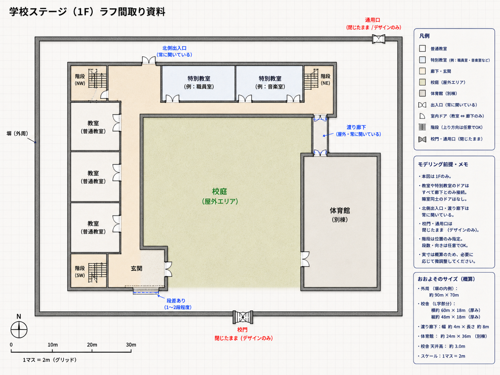

# HAIGURE SURVIVAL v2 B01 承認済み学校間取り

更新日: 2026-07-18

## 1. 位置付け

本書は、B01「学校間取り相談」で承認された学校ステージの構成をB02へ引き継ぐ正本である。参照画像は厳密な建築図ではなく、Blenderブロックアウトの基礎となる配置イメージとして扱う。

B02では本書の構成を維持しつつ、実寸、視認性、キャラクターの通過、Blenderでの作りやすさに合わせて寸法と細部を調整してよい。大きな間取り変更が必要になった場合は、Blender上でユーザーへ提示して承認を得る。

## 2. 全体構成

- 校舎はL字型の3階建てとする。
- L字の内側を中庭型の校庭とする。本格的な競技場ではなく、集合、戦闘、移動に使う屋外空間として扱う。
- 体育館は校舎とは別棟にし、屋外の渡り廊下で接続する。
- 校舎1階、校庭、渡り廊下、体育館をプレイ可能範囲とする。
- 校舎2階・3階は外観だけを成立させ、内部、窓、机、小物、詳細装飾はB02で作らない。
- 外周は塀で囲い、校門・通用口は閉じたデザインとして残す。
- 北側出入口は常時開放する。

参照画像の概算外周約90m×70m、体育館約24m×36mを初期参考値とする。校舎全体の確定寸法は、B02で廊下、教室、トイレ、階段が自然に収まるように調整する。

## 3. 校舎1階

### 廊下・玄関

- 通常廊下の幅は約3mを基準とする。
- 曲がり角、階段前、玄関は必要に応じて広げてよい。
- 南側に主玄関を置き、外部との間に1～2段程度の段差を設ける。
- 北側出入口にも、小規模な副玄関とたたきを設ける。
- 北側出入口と渡り廊下は常時開放する。

### 普通教室・特別教室

- 普通教室は約8m×9mを初期基準とする。
- 有効天井高は約3.0～3.3m、階高は約3.6～4.0mを目安とする。
- 普通教室は廊下側の前方と後方に出入口を1つずつ設ける。
- 出入口は学校らしい引き戸のデザインとし、常に開いた状態で固定する。
- 開閉アニメーション、開閉ギミック、教室同士を直接つなぐ扉は作らない。
- 最大約2m×1mのキャラクターが通れるよう、教室扉は有効幅約1.1～1.2m、有効高さ約2.2～2.3mを初期基準とする。
- NPCの周回経路を増やすためだけの追加扉や抜け道は設けない。

### トイレ・倉庫

- 北西出入口付近の北西階段横に、男女別トイレをまとめた区画を1か所設ける。
- 校舎1階には、一般倉庫や用途未定の小部屋を設けない。
- 校舎用倉庫が将来必要になった場合は、2階以上の未制作領域で扱う。

## 4. 階段

3か所すべてを間取り上の階段として維持する。

| 階段 | 向き・踊り場 | B02の通行範囲 |
|---|---|---|
| 北西 | 北向き。北側壁沿いの踊り場で折り返す | 1階から最初の踊り場まで |
| 北東 | 北向き。北側壁沿いの踊り場で折り返す | 1階から最初の踊り場まで |
| 南西 | 東西方向。西側壁沿いの踊り場で折り返す | 1階から最初の踊り場まで |

- 階段は蹴上約0.15m、踏面約0.30mを初期基準とする。
- 最初の踊り場までは、階段昇降の動作確認に使える形状にする。
- 踊り場で折り返した先は、不可視の衝突壁で閉鎖する。
- 閉鎖用の壁、扉、柵などの外観はB02では必須としない。
- 表示用の段`VIS_`と、移動用の連続ランプ`COL_StairRamp`を分離する。

## 5. 体育館

- 参照画像の約24m×36mを初期基準とする。
- 天井高は約8～10mとし、校舎の天井高とは分けて扱う。
- 南側に舞台を設ける。
- 北側に体育倉庫を設ける。体育倉庫は体育館内部から利用する構成を基本とする。
- 舞台と体育倉庫を含めても、最大100人を配置できる中央床面を確保する。
- 体育館西側の校庭出入口と、北側の渡り廊下接続を維持する。

## 6. 集合・ゲーム内動線

- 集合・公開処刑の第一候補は校庭とする。
- 体育館も集合・公開処刑の候補とし、校庭と体育館の両方で最大100人を配置できる空間を確保する。
- 大きな周回は「校舎―渡り廊下―体育館―校庭―主玄関―校舎」で成立させる。
- 教室や閉鎖階段に行き止まりが生じても、NPC都合の追加扉は作らず、学校として自然なデザインを優先する。
- 100人の具体的な整列間隔と配置形状は、B02以降のゲーム内確認で調整する。

## 7. T01資産規約からの制約

- BlenderはMetric、1 unit＝1mとする。
- BlenderのX＝右、Y＝前、Z＝上を使用する。
- 表示形状は`VIS_`、簡略衝突形状は`COL_`で始める。
- Object名とMesh Data名の接頭辞を一致させる。
- 配置完了時にscaleを1へ適用する。
- 階段、床、壁、天井、段差、踊り場の表示と衝突を分離する。
- GLBは実メートルで出力し、ゲーム側で管理親に0.25倍を適用する。
- 規約外形状を読み替える互換処理やフォールバックは作らない。

## 8. B02で調整してよい内容

- 校舎外形と各翼の長さ
- 普通教室・特別教室の最終数と用途名
- トイレ内部の個室数と簡略配置
- 階段室の細かな壁形状と閉鎖位置
- 主玄関・副玄関の段差と幅
- 舞台と体育倉庫の正確な寸法
- 2階・3階外観の高さと屋根形状
- モック確認用の仮配色

上記の調整は、承認されたL字校舎、中庭型校庭、別棟体育館、3階段、北西トイレ、体育館の舞台・体育倉庫という骨格を維持して行う。
