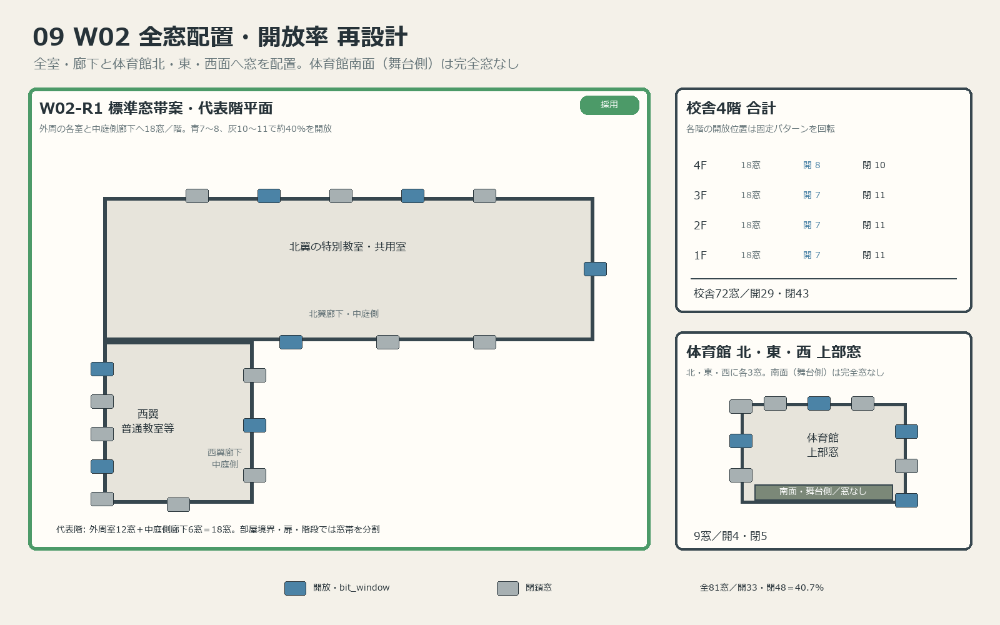
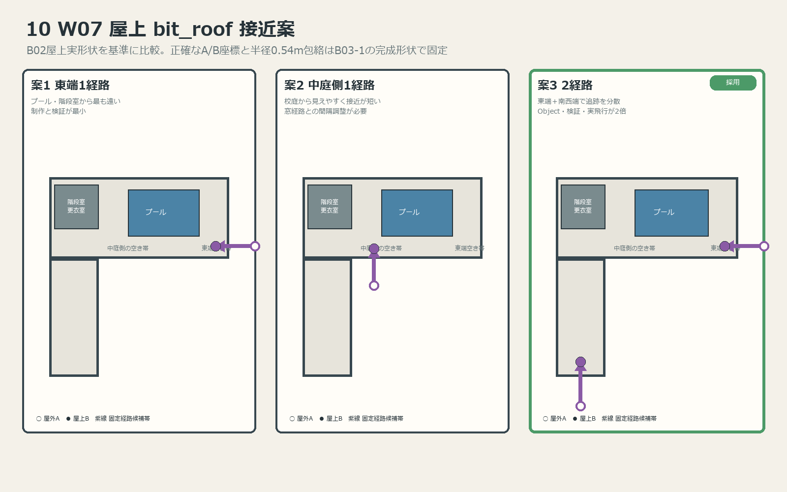

# B03-0B ビット通過窓・屋上接近 候補設計

更新日: 2026-07-20

## 目的と回答方法

T04-2Aから引き渡された`bit_window`と`bit_roof`の契約を満たしつつ、学校の見た目、侵入方向、制作量を比較して、B03-1で実装する正確な窓構成と屋上接近箇所を承認する。

`W07`はユーザー回答により案3で確定した。`W02`は、前回案が窓の総配置とビット通過窓数を混同していたため撤回し、全窓配置を含む`W02-R1`～`W02-R3`へ改訂した。ユーザー回答により、体育館南面（舞台側）を完全な窓なしとする修正版`W02-R1`で確定した。

## 確定済み契約

- 校舎1～4階へ最低各1か所のビット通過窓を設ける。屋上は窓の設置対象外とする。
- 通過窓はビット専用・双方向とし、`COL_HumanOnly_Window_*`と`bit_window`の`LNK_<id>_A/B`を組み合わせる。
- 閉じた窓は`COL_ActorOnly_Window_*`とする。両種の窓は視線と全光線を通す。
- 通過窓は有効開口1.08m角以上を必須とし、B03では左右2枚引違い窓の片側開放として1.20m×1.80m以上を確保する。
- `bit_window`と`bit_roof`の固定経路全体に半径0.54m以上の空きを確保する。
- 通常歩行用NavMeshを窓越しに接続せず、A/B待機位置と経路へ家具・散乱物を置かない。
- 屋上接近は屋外A・屋上Bの双方向`bit_roof`とし、庇、外壁、手すり、プール、更衣室、階段室を避ける。

## B02実形状の読み取り結果

保存済みB02 `.blend`をBlender 5.2.0 LTSの別バックグラウンドプロセスで読み取り、保存や書き出しは行っていない。

- 窓ガイドは校舎1階18面、2階18面、3階18面、4階18面、体育館上部12面である。
- 校舎窓ガイドの高さは1階が1.2m、2～4階が1.6m、体育館上部が1.6mである。
- B02の窓ガイドは窓帯を示す仮資料であり、ガイド1面を通過窓1か所として流用しない。
- 北翼屋上はX=-12.6～47.4m、Y=32.5～45.5m、西翼屋上はX=-12.6～0.0m、Y=-3.5～32.5mである。
- 屋上施設は北西側X=-12.6～2.4m、Y=38.5～45.5m、プール設備は概ねX=12.4～36.4m、Y=35.0～43.0mを占める。
- 北翼東端X=40～47m付近、中庭側X=4～10m付近、西翼南端X=-8～-5m付近に、比較的大きな空き帯がある。

## 2026-07-20 W02再設計の前提

- 窓の最終位置・総数は、これまでユーザー承認していなかった。B02ガイドは壁面候補の仮資料にすぎない。
- 原則として普通教室、特別教室、職員室、保健室、図書室、PC室、LL教室、音楽室など、全ての居室へ外窓を設ける。トイレと階段室にも、用途に合わせた曇りガラスまたは縦長窓を設ける。
- 西翼・北翼の中庭側廊下にも、扉、階段、壁柱を避けながら連続的に窓を設ける。
- 校舎の外周側と中庭側の両方で、用途上不自然でない壁面の大部分へ窓を配置する。
- 体育館は北・東・西の3面へ上部窓を配置する。南面（舞台側）は閉窓ではなく完全な窓なしとする。
- 破損窓は採用せず、窓5枚につき約2枚を通常の開放状態、約3枚を閉鎖状態にする。
- 「ランダム」は実行時抽選ではなく、複数の開閉パターンを壁面ごとに固定配置して表現する。`LNK_*`のID・位置とGLBハッシュを実行ごとに変えない。

## W02 全窓配置の改訂案

| ID | 構成 | 総窓・開放数 | メリット | デメリット |
|---|---|---:|---|---|
| W02-R1 | B02の18窓帯／階を壁面候補として再配置。各1地点を左右2枚引違いユニット2～4組の連続窓帯とし、体育館は北・東・西に各3窓帯。南面は窓なし | 校舎72＋体育館9＝81窓帯。片側開放33、全閉48、破損0 | 現Blockoutと整合し、全室・廊下と体育館3面を連続した大きな窓面で覆える | 1窓帯内の多数のガラス羽を1 Objectへまとめるため、羽単位の構成を監査する必要がある |
| W02-R2 | 部屋幅に比例し、9～10m室は1窓帯、18～20m室は2～3窓帯、廊下は約8m間隔、体育館は北・東・西に各4窓。南面は窓なし | 約100窓。開約40、開放率約40% | 大型室の採光と外観リズムが自然 | R1よりCollider・`LNK_*`・透明面が増える |
| W02-R3 | 外周・中庭側を連続窓帯に近づけ、壁柱と設備部分だけを閉じる。体育館は北・東・西に各5窓。南面は窓なし | 約127窓。開約51、開放率約40% | 窓が多い学校という印象が最も強い | 古い公立校より現代校寄りに見え、描画・実飛行検証量が最大 |

採用: **W02-R1（体育館南面窓なし・連続窓帯最終版）**。階段を除く通常窓は1枚幅1.20m、2枚引違い1ユニット2.40mとし、4枚窓帯4.80m、8枚窓帯9.60mの有効幅を持つ。普通教室は連続8枚窓帯へ統合する。中庭西・北側は2～4階を基準に等間隔配置し、1階だけ出入口干渉分を撤去または縮小する。体育館東西面は3組を等間隔配置し、南面（舞台側）には窓を一切設けない。全83窓帯中49窓帯の58ユニットは片側だけを開放し、他方へガラスを二重に重ねる。指定3室は対象窓を全開、3階普通教室Room03と2階生徒会室は全閉とする。

以下の図はB03-0で81窓帯・33開放を採用した時点の比較記録である。最終配置と開閉状態は上記本文、および`images/architecture/`の29枚を正とする。

### W02-R1の代表階18窓帯配分

| 壁面帯 | 窓数 | 主な対象 | 開放基準 |
|---|---:|---|---:|
| 西翼外周側 | 5 | 普通教室、保健室、図書室など | 2 |
| 北翼外周側 | 5 | 職員室、PC室、各特別教室、階段・共用区画 | 2 |
| 西翼中庭側 | 3 | 西翼廊下 | 1 |
| 北翼中庭側 | 3 | 北翼廊下 | 1～2 |
| 南端・東端 | 2 | 端部室、階段・共用区画 | 1 |
| 合計 | 18 | 各階 | 1～3階は7、4階は8 |

1階は保健室、図書室、職員室、PC室、廊下、階段・共用区画、2階は三年生教室、生徒会室、放送室、理科室、3階は二年生教室、美術室、家庭科室、4階は一年生教室、LL教室、音楽室の全てへ最低1窓帯を割り当てる。18～20mの統合室は、隣接する2窓帯を同じ室へ割り当てる。

男女トイレは外壁側へ曇りガラス窓、階段は踊り場ごとに縦長窓を置き、18窓の端部・北翼外周枠へ含める。屋上の男女更衣室にも曇りガラスの採光窓を設けるが、屋上はT04契約上の窓侵入対象外であるため閉鎖状態とし、`bit_window`を付けない。

### 体育館9窓配分

| 壁面 | 窓数 | 開放 | 閉鎖 |
|---|---:|---:|---:|
| 東面上部 | 3 | 2 | 1 |
| 西面上部 | 3 | 1 | 2 |
| 北面上部 | 3 | 1 | 2 |
| 南面上部（舞台側） | 0 | 0 | 0 |
| 合計 | 9 | 4 | 5 |

北・東・西面では、体育倉庫や渡り廊下接続と干渉する窓を同じ壁面内で横へずらす。南面（舞台側）は閉じた窓を置く場所ではなく、窓枠、ガラス、窓Collider、`bit_window`を含めて完全に窓なしの壁面とする。

### 固定開閉パターン

5窓単位では、`閉・開・閉・開・閉`、`開・閉・閉・開・閉`、`閉・開・開・閉・閉`、`開・閉・閉・閉・開`を壁面ごとに回転して使う。短い3窓帯は原則1窓、4窓帯は1～2窓を開け、フロア全体で約40%へ合わせる。開放窓は全て破損なしの引き違い窓または高窓の通常開放とする。

各開放窓は左右2枚の片側を引いた有効開口1.20m×1.80m以上とし、半径0.54m包絡を通す。全閉の窓帯は`COL_ActorOnly_Window_*`、開放窓帯は閉じた羽の`COL_ActorOnly_WindowFixed_*`と開口の`COL_HumanOnly_Window_*`、`bit_window` pairを持つ。

## W07 屋上`bit_roof`の位置と本数

| 案 | 構成 | 候補帯 | メリット | デメリット |
|---|---|---|---|---|
| 案1 | 1経路 | 北翼東端。屋外Aを東外側、屋上Bを東端空き帯へ置く | プール・屋上施設から最も遠く、制作と検証が最小 | 西側から屋上へ向かう場合の迂回が長い |
| 案2 | 1経路 | 北翼中庭側。屋外Aを中庭、屋上BをX=4～10mの空き帯へ置く | 校庭から見えやすく、中央の戦闘から接近しやすい | 校舎の窓経路や中庭側演出との間隔調整が必要 |
| 案3 | 2経路 | 案1の東端＋西翼南端 | 東西どちらの屋外からも屋上を追跡しやすい | `LNK_*`、安全包絡、T05-1実飛行、T04-2B回帰が2組必要 |

採用: **案3**。1か所だけからビットが上昇すると不自然に見えるため、北翼東端と西翼南端の2経路へ分散する。2組とも半径0.54m包絡と固定経路を個別監査する。

### W07実装時の固定条件

- 屋上手すりを欠落させて通路を作らず、固定経路の移動包絡が手すり、外壁、庇を越えて屋上Bへ到達できる位置・高さを選ぶ。
- A/Bの正確な座標は、B03-1で最終手すりと屋上設備を作った後に半径0.54m包絡を通して固定する。本書の座標帯は候補比較用であり、Object座標の承認値ではない。
- 屋上Bから階段室、プール、更衣室へ向かう通常NavMeshを維持し、B付近へベンチ、ロッカー、救命具、散乱物を置かない。
- T05-1の実飛行がA/B間の固定経路だけを使い、屋外の任意地点から自由上昇しないことを後続で確認する。

## 回答表

| ID | 推奨 | 回答 | 状態 |
|---|---|---|---|
| W02 | W02-R1 | W02-R1（体育館南面は完全窓なし） | 確定 |
| W07 | 旧推奨案1 | 案3 | 確定 |

## 承認後の引き渡し

- B03-0で採用案、候補壁面、見た目、経路数を確定する。
- B03-1で実外壁、開口、窓枠、ガラス、Collider、`LNK_*`、`NAV_*`分離、天井Colliderを実装する。
- 体育館南面（舞台側）には`VIS_WindowFrame_*`、`VIS_WindowGlass_*`、`COL_ActorOnly_Window_*`、`COL_HumanOnly_Window_*`、窓用`LNK_*`を作らない。閉窓への読み替えも禁止する。
- B03-2は機能Objectの名前・位置・開口寸法とA/B周囲の禁止帯を維持して内装を配置する。
- T04-2Bで実学校の経路分類、T05-1で固定経路の実飛行、T06で学校全域のゲーム統合を確認する。
