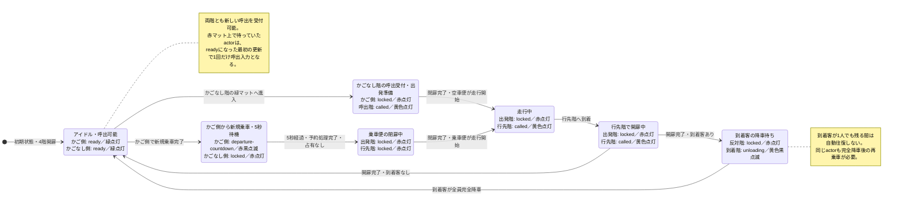

# HAIGURE SURVIVAL v2 T04-3 動的空間・扉・エレベーター統合 計画

更新日: 2026-07-29

## プロンプト

普通教室・特別教室とトイレ個室の扉をプレイヤーとNPCが開閉できるようにし、静止中は人物衝突、ビーム遮蔽、視線遮蔽を有効にする。BITは閉じた扉を通れず、扉を操作できない。

1階・4階だけに停止するエレベーターを、プレイヤー、未洗脳NPC、洗脳済みNPCが単独でも利用できるようにする。扉の`closed / opening / closing`中は人物用全面ゲートで駆け込みを防ぎ、実扉パネルだけをビーム・視線遮蔽として扱う。定員は全キャラクター合計6人とし、降車を妨げずに7人目の乗車だけを拒否する。

20室の通常・荒れvariantを開始時に抽選し、プレイヤーと全NPCが倒れた机・棚の上を歩けるNavMeshを組み立てる。閉扉、エレベーター状態、選択variantを、人物移動、ビーム、視線、BIT経路へ動的に反映する。

2026-07-28、最新の`origin/develop`を取得し、`4edd8f08c948a7822cd6bd623e25dff142078f18`以降を基点として、専用ブランチ`codex/v2-t04-3-dynamic-runtime`と専用worktreeを作成してT04-3Aを実装する。B03-3Cが別worktreeで進行中のため、学校`.blend`、GLB、両NavMesh、学校生成スクリプト、カタログhash、B03-3C worktreeを変更しない。各実装ステップで本計画を更新し、型検査、T04 fixture、`build:t04`、実ブラウザ確認まで実施する。commitまでは行い、push、Pull Request作成、`develop`へのmergeは別途指示まで行わない。

2026-07-28 統合指示:

> 隣のタスクのT05-3を実装したタスクをまず読み込んでください。その内容が、もうコミットが完了しており、こちらのT04-3Aに統合をして良い状態であれば、こちらを統合headへ切り替えて、推奨手順でこの後、`develop`へのPull Requestを作るところまで行ってください。まだ駄目な状態であれば、次に何をすれば進められるのか提案してください。

2026-07-28 方針変更:

> Pull Requestは作らなくてよいです。このまま後でB03-3Cのbranchへローカルで取り込みます。Pull Requestを作成済みであればcloseしてください。

2026-07-29 T04-3B実装指示:

> PLEASE IMPLEMENT THIS PLAN:
>
> # T04-3B 実学校動的統合 実装計画
>
> ## 概要
>
> - 実行直前に`origin/develop`を再取得し、B03-3C・B04・T04-3A・T05-3・T05-4が祖先であることを再確認する。確認済みHEADは`3803e51`。
> - `codex/v2-t04-3-school-integration`と専用worktree `../fps_survival20251226-t04-3-school-integration`を最新`origin/develop`から作成する。
> - 現worktreeの未コミット人口調整は変更・stash・取り込みをせず、学校`.blend`、GLB、両NavMesh、生成器、カタログhashも変更しない。
> - T04-3個別計画へ今回のプロンプト、正確な日付、工程、最終結果を記録し、各工程後にチェックを更新する。全体計画・ロードマップ・ブランチ戦略は、I0／B04／T05-4の統合済み状態と「外周BIT飛行帯なし」の最新契約へ同期する。
>
> ## 実装変更
>
> ### 20室variantと動的空間
>
> - `createSchoolRoomVariantSelections(settings, seed)`を追加し、Stage読込前に20室のnormal／disorderedを確定する。荒れ室数はレベル0／2／10で0／4／20室、同seedでは同一結果、セッション中は不変とする。
> - 選択variantから人間用NavMesh、Collider、視線・ビーム・BIT障害物を組み立てた後に、スポーンと空間indexを生成する。
> - 静的基底集合から通常扉パネルとエレベーター人物ゲートを除外し、通常扉snapshot、エレベーターsnapshot、選択variant基底を`SchoolStageDynamicRuntime`で合成する。
> - 更新順を「前更新の要求取込→呼出・予約・占有判定→扉・かご・搬送更新→active setを1回だけ原子公開→プレイヤー・ビーム・NPC・BIT更新→次更新の要求蓄積」に固定する。Transformだけが変化した場合もrevisionを進める。
> - revision 0の時点で、部屋選択、通常扉の初期状態、4階開放中のエレベーター状態をすべて反映する。
>
> ### 扉・エレベーター
>
> - 実学校の38室扉、24トイレ扉、3エレベーター扉を実資産adapterへ接続する。室扉は20%閉、トイレ扉は全開で開始する。
> - 全陣営NPCが必要な閉扉を開け、記録した進入側から反対側へ抜けて人物楕円体が最終位置・掃引Volumeの両方を離れた時点を「通過完了」とする。完了時に30%で閉扉を1回だけ試し、占有中なら破棄して再試行しない。
> - 移動中の扉パネルは人物・ビーム・視線・BIT集合から外し、完全open／closed時は実パネル位置で全集合へ戻す。
> - エレベーターは1階／4階、4階開放開始、初回待機5秒、開閉1秒、走行6秒、予約込み定員6人を維持する。同時要求は要求時刻、同一時刻はActor ID順で処理する。
> - プレイヤー、未洗脳NPC、洗脳済みNPCを同じactor bridgeで搬送し、かご相対座標、視線、戦闘、標的選択個性、Follow／Leave状態を保持する。7人目の乗車だけを拒否し、降車は常に許可する。Follow中NPCが拒否された場合だけFollowを解除する。
> - 通常ゲームのC入力、候補highlight、F／E、G／N／H、音声、既定荒れレベル2のゲーム入口接続はT06へ残す。T04-3Bでは本番用APIと実学校fixtureまでを完成させる。
>
> ### NPC経路・陣営動作
>
> - `NavigationWorld`は階段のsurface経路を見つけても即決せず、surface経路とエレベーターlink経路を列挙し、必須の`NavigationRoutePolicy`で比較する。互換overloadや暗黙fallbackは追加せず、全利用元を明示policyへ移行する。
> - `StageElevatorTripEstimate`で現在のかご位置、呼出、待機、開閉、走行、予約、定員を含む予測時間を返す。
> - NPCごとの`patience`と`riskTolerance`をセッションseed＋安定NPC IDから0～1で決定する。階段時間は経路距離÷現在速度、エレベーター時間は前後の歩行時間＋予測時間とする。
> - エレベーターを選ぶ条件は `elevatorSeconds + riskPenalty <= stairsSeconds + 5 * patience`。`evade`中は呼出マットまでの水平距離3.0m以内を候補とし、敵への露出中だけ`5 * (1 - riskTolerance)`秒を加算する。
> - 未洗脳NPCの「視認中の洗脳済みNPCがいる便を避ける」規則は絶対条件とし、traitsでは緩和しない。洗脳済みNPCは同便、次便、階段の順に追跡可能性を比較する。
> - 経路比較の再評価は、標的・目的階・陣営・指示・`evade`状態の変更、扉の安定状態到達、かご到着／出発、予約／定員結果、敵視認状態の変更、stuckに限定する。同点では現経路を維持し、初回同点は階段を選ぶ。
> - NPCとの境界は`V2NpcTraversalRequest`／`V2NpcTraversalResult`のメッセージ型にし、開扉、通過完了、呼出、予約、乗車、降車を受け渡す。搬送中もNPC本体を再配置・再生成せず、`NavigationAgent.completeTransition()`を降車時に1回だけ実行する。
>
> ### 動的consumer
>
> - `StageSpatialQueries`へVolume ID指定の包含・人物楕円体交差queryと、revision対応のビーム／視線開始点包含queryを追加する。座標推測、AABB代用、旧静的配列fallbackは設けない。
> - プレイヤーcontrollerへsnapshot同期と、視点・入力・運動状態を保つ搬送位置更新APIを追加する。revision更新時に`surroundingMeshes`と接地集合を同じsnapshotへ同期する。
> - ビーム開始点包含とprewarmを静的`stage.resources`から外し、現行9発射元すべてをrevision付きqueryへ統一する。トラップ光線と動的3Dマップビームは追加しない。
> - BITは全StageLinkの呼出・予約・乗車・利用を禁止し、独自飛行遷移だけを維持する。revision変更時は障害物依存cacheを破棄し、進行区間を新snapshotで再検証して不安全時だけ再経路計画する。到達不能中はrevision変更時に再探索する。
> - 破棄時は扉状態、予約、乗客、NPC traversal state、revision資源、BIT cache、購読をすべて解放する。
>
> ## 公開API・型
>
> - `createSchoolRoomVariantSelections(...)`
> - `SchoolStageDynamicRuntime`／`SchoolStageDynamicRuntimeSnapshot`
> - `StageElevatorRuntime.estimateTripSeconds(...)`／`StageElevatorTripEstimate`
> - 必須`NavigationRoutePolicy`と、明示的な距離policy・学校NPC policy
> - `StageSpatialQueries.containsVolumeById(...)`、人物楕円体交差、動的blocker包含query
> - `V2NpcTraversalState`／`V2NpcTraversalRequest`／`V2NpcTraversalResult`
> - プレイヤーのsnapshot同期・状態保持搬送API
>
> 既存APIの互換wrapper、未定義時fallback、静的Colliderへの退避経路は追加せず、利用元を新契約へ統一する。
>
> ## テスト計画
>
> - T04実学校統合fixtureを追加し、完了条件を`document.documentElement.dataset.validationStatus === "passed"`へ統一する。
> - 自動回帰で、variant 0／4／20室、seed再現、65扉metadata、全陣営開扉、30%閉扉、占有中止、定員6、7人目拒否、降車保証、単独呼出・往復・搬送を確認する。
> - 階段／エレベーター双方の選択、traits再現、再評価の非振動、陣営別回避・追跡、閉扉時の視認解除、かご内戦闘、T05-4の`persistent`／`nearest-visible`とAlarm／Alert優先順位を回帰する。
> - 全9光線、視線、人物衝突、接地、BIT経路をclosed→opening→open→closing→closedで確認し、同一更新中は同じrevisionだけを使用すること、BITの呼出・予約・乗車・elevator link利用が0件であることを検証する。
> - B04の`worldBoundary`が非null、外周BIT経路0件、学校資産hash不変、破棄・再読込後のScene／NavMesh／snapshot／予約／購読残留0件を確認する。
> - 実行コマンドは依存監査、学校NavMesh check、V2／T04／T05型検査、T04／T05／通常build、`git diff --check`。T04・T05 fixtureは実行時点の全件PASSを記録し、古い件数を固定しない。
> - WebとElectronの両方で、NPC 50体（初期洗脳済み10体）／BIT 20機を10分、NPC 99体（初期洗脳済み66体）／BIT 50機を2分実行する。後者はクラッシュ・停止・意味回帰を見る短時間stressであり、FPS合否や最終性能最適化はT07へ残す。
> - console warning／error、Babylon Logger error、unhandled rejectionを個別に0件確認し、通常ゲームの既存Pointer Lock・移動も回帰する。
> - UTF-8 strict・BOMなし、ローカル絶対パス混入、競合marker、括弧対応を検査し、独立レビュー後に単一commit `feat: T04-3Bの実学校動的統合を実装`を作成する。
>
> ## 前提・完了境界
>
> - 陣営安全規則は固定し、忍耐度・危険許容度は待機対階段と再評価時機だけへ影響させる。
> - 現worktreeの人口差分は保護し、検証fixture側の明示設定で50／10／20を再現する。
> - 完了範囲は実装、計画更新、全検証、独立レビュー、commitまで。push、Pull Request作成、merge、review thread操作、worktree削除は行わない。

2026-07-29 人間受入後のエレベーター修正指示:

> エレベーターがカメラに入った途端、視界に入った途端にガクガクとし始めました。1秒間に10フレームぐらいの、そこそこのガクガク状態になりました。
>
> エレベーターの箱が来ていない1階の黄色いカーペットの上に立ちましたが、いつまで経ってもエレベーターが降りてきませんでした。
>
> 4階の開いているエレベーターの中に入りましたが、何秒待っても扉が閉じたり、エレベーターが移動したりしませんでした。現状の仕様として動くようになっているのであれば、バグだと思うので確認してください。
>
> 黄色いマットが少し狭いので、1.5メートル四方ぐらいまで大きくしてください。その中で待っていればエレベーターが移動してきてくれる機能も含めて、マットの大きさを広げてください。
>
> 扉の開閉ができる予定であれば、C、F、Eのどれを押しても扉が動かず、操作説明にもC、F、Eが出ていない点を修正してください。
>
> 扉の敷居の前後約1メートルで、扉の表側・裏側のどちらからでも開閉できる仕組みか確認してください。引き戸の取っ手が外側にしか見えないため、教室の内側から開けない見た目との不一致を懸念しています。機能的に表裏どちらからでも開閉できるのであれば問題ありません。

2026-07-29 公開指示:

> プッシュしてPull Request作成を行ってください。

- 読み取り診断により、通常ゲームはNPC traversal要求だけを処理し、プレイヤーの呼出、予約、乗車、降車を生成していないことを根本原因として確認した。既存fixtureはRuntime直呼出またはNPC要求注入であり、この通常入口の欠落を検出していなかった。
- 黄色い待機マットは表示と`elevator_call_mat` Volumeをともに1.5m×1.5mへ拡張する。敷居との非重複を維持するため、エレベーター側の既存端を固定して廊下側へ広げる。
- マット内にプレイヤーがいる間は呼出を維持し、到着後は予約を保持する。マット占有者自身が開扉を止めないよう、エレベーター扉の実掃引範囲と待機範囲を分離する。
- プレイヤーが開放中のかごへ入った場合は反対階への乗車を登録し、5秒待機、1秒閉扉、6秒走行、1秒開扉を通常Runtimeで実行する。到着後にかごから出た時点で降車完了とする。
- 旧「学校資産を変更しない」境界は、この追加指示に限り待機マット表示、判定Volume、対応する生成器・監査・仕様、学校`.blend`／GLB、カタログGLB hashの変更で上書きする。人間用NavMesh、部屋variant NavMesh、BIT用NavMeshは形状対象外として不変を確認する。
- `C / F / E`、候補highlight、操作説明を含むプレイヤーの通常扉操作は、計画どおりT06へ残す。ユーザーはこの境界を了承済みである。
- 通常扉候補は扉基準点から半径1.0m以内で、表裏や取っ手側を区別しない。開閉トグルは両側で同じ契約を使い、閉扉時だけ人物の最終位置・掃引範囲占有を安全中止するため、この契約は変更しない。

2026-07-29 第2次人間受入修正・仕様確定指示:

> エレベーターへ乗り込む際、扉の敷居付近で引っかかることがある。段差または入口幅のどちらが原因か特定し、原因を修正する。入口が狭い場合だけ、必要な範囲で広げる。
>
> 1階の呼出マットには上向き三角、4階には乗場から見て下向き三角を表示する。マットは各階独立表示とし、プレイヤーまたはNPCが短時間でも踏み込んだ時点で呼出入力とする。
>
> マット表示には、緑、黄色、黄色／黒点滅、赤／黒点滅、赤を使う。かごがない側の階は、他階で降車中、乗車待機中、閉扉中など新しい呼出を受けられない間は赤とする。新しい呼出を受けられるアイドル状態になったら緑とし、その階へ向かう便が確定済みなら緑を挟まず黄色へ変える。
>
> 到着した乗客は一度かごから完全に降りなければならない。同じ人物が再び利用する場合は、降車後に乗り直して新しい乗車を成立させる。乗客が残っているだけで反対階へ自動的に戻らない。
>
> 空車で開扉中、または到着客が全員降りた状態は緑とする。到着客がまだかご内に残っている間は黄色／黒点滅、誰かが新しく乗車して発車待機に入ったら赤／黒点滅、閉扉開始後は赤とする。

## エレベーター状態遷移図

- 緑は「現在、新しい呼出または乗車を受け付けられる」、黄色は「その階への便が確定している」、黄色／黒点滅は「到着客の完全降車待ち」、赤／黒点滅は「新規乗車後の発車待ち」、赤は「現在は新しい呼出・乗車を受け付けられない」を意味する。
- 目的階が確定済みの場合、行先階は赤から緑を挟まず黄色へ変わる。便が完了してアイドルへ戻る場合だけ、かごがない側を含む両階が緑へ戻る。

## 確定方針

### T04-3A 動的空間基盤

- `docs/spec_stage_runtime_v2.md` 4節を必読の型正本とし、`DynamicStageSpatialActiveSet`、`DynamicStageSpatialSnapshot`、`DynamicStageSpatialVariants`を同名で実装する。人物Collider、ground Collider、ビーム遮蔽物、視線遮蔽物、BIT障害物の5集合を1つのrevision付きsnapshotとして公開する。
- 初期variantをrevision 0とし、状態機械と全動的Transformを更新して次の5集合を`replaceActiveSet()`へ渡す。同メソッド内で次revision用の索引・cacheを構築し、集合・cache・revisionを持つsnapshot参照を最後に原子的に差し替える。遮蔽中のエレベーター扉パネルのTransform変更もrevision更新対象とする。
- 動的扉を含む各問い合わせは開始時の1 snapshotだけを使う。known-safe-center、ground、world三角形、空間索引、扉gate・BIT障害物依存の経路cacheはrevisionをkeyへ含めるか公開前に無効化し、静的配列へのfallbackを追加しない。
- `StageSpatialResources`は全作者ObjectとAssetContainerだけを所有し、現在有効な集合の正本にしない。`DynamicStageSpatialVariants`はsnapshot、動的索引、cache、購読を所有し、作者Mesh自体は所有しない。
- 通常の人間用扉は連続NavMesh上のgateとして扱い、閉扉時も人間用NavMesh自体を分断しない。NPCは必要な扉を開けて通る。
- エレベーターだけを`StageLinkKind: "elevator"`の明示遷移として扱い、`NavigationAgent.completeTransition(...)`で移動完了後の経路を再開する。
- 20室の通常・荒れ人間用NavMeshタイルを開始時に選択・結合し、プレイヤー、NPC、BIT、空間indexの生成前に確定する。
- 2の20乗の全体NavMeshを作らず、部屋variantごとの所有タイルを組み立てる。
- `docs/spec_stage_assets_v2.md` 7.9節のmarker／volume roleと許可`hs_*`を厳格登録し、`StageDoorAssetRegistry`と`StageElevatorAssetRegistry`を非学校fixtureで構築する。未知key、参照不正、孤立・多重所有を許可しない。

### 教室・トイレ扉状態機械

- 状態は`closed / opening / open / closing`、開閉時間は0.8秒とする。
- プレイヤーはCキーで約1m以内の候補を操作する。候補順は画面中央との角度、次に距離とする。
- 教室扉は独立した`door-initial`乱数系列で20%を閉状態から開始する。トイレ個室は必ず開状態から開始する。
- 静止中は現在の扉位置で人物衝突、ビーム遮蔽、視線遮蔽を有効にし、移動中だけ無効にする。
- 閉扉開始前に最終位置と掃引Volumeを確認し、人物がいれば閉扉を中止して再開する。自動再試行queueは持たない。
- 全陣営NPCは必要経路上の閉扉を必ず開ける。通過完了ごとに独立した`door-behavior`系列で30%の閉扉を試み、占有中ならその試行を破棄する。
- BITは扉を操作せず、閉扉を移動・ビーム・視線経路から除外する。

### エレベーター状態機械

- 初期状態は4階停止・扉開放とする。停止階は1階と4階だけとする。
- 最初の搭乗者から5秒待機、扉開閉1秒、階間移動6秒とする。追加搭乗者は待機時間をリセットしない。
- `ready`の呼出マットへプレイヤー、未洗脳NPC、洗脳済みNPCのいずれかが入った時点で呼出を登録する。NPCはプレイヤー不在でも呼出でき、マット自体を立入禁止領域にしない。
- `locked`中から同じactorがマット内に残り、マットが`ready`へ変わった場合は、その最初の呼出可能更新を進入と同じ入力として1回だけ扱う。呼出受付後はactorが離れても便の成立まで保持し、同じ滞在から毎更新重複要求しない。
- 呼出を登録したNPCはマット外の待機点へ移り、乗車予定のないNPCもマット外で待つ。共有の階呼出とactor固有の乗車予約を分離し、actorが待機を放棄した場合も共有呼出は解除しない。マット自体は扉パネルの物理掃引範囲ではないため開閉を阻害しない。
- 一つの呼出または乗車便が成立した後は、便が完了して両階が`ready`へ戻るまで新しい階呼出を受け付けず、走行中の追加呼出もqueueしない。成立済みの行先は途中変更せず、行先階を`called`として維持する。
- かご内の乗客IDと相対座標を保持し、走行中は毎フレーム搬送する。
- 到着した乗客は`arrived`として扱い、かご占有Volumeから完全に出た時点で降車完了とする。`arrived`乗客が1人でも残っている間は扉を開放して反対階へ自動出発せず、新規乗車も成立させない。
- 同じactorが反対階へ戻る場合も、降車完了後にかごへ入り直して新しい乗車予約と乗車完了を成立させる。強制降車、時間切れによる自動降車、残留したままの行先再利用は設けない。
- 開閉状態は`closed / opening / open / closing`、かご状態は`stopped / moving`を直交して管理する。

### 呼出マット状態・表示

- `ElevatorCallMatState`は`ready / called / unloading / departure-countdown / locked`の5状態とし、各停止階のsnapshotに必須で含める。
- `ready`は緑点灯とする。エレベーターがアイドルで新しい呼出を受けられる場合は、かごがある階と反対階をともに`ready`とする。空車での開扉完了、または到着客が全員降車して新規乗車者がいない状態も`ready`とする。
- `called`は黄色点灯とする。その階の呼出が受理された後、かごの移動中と到着後の開扉完了前まで使用する。目的階が確定済みの場合は`locked`から`ready`を挟まず`called`へ移る。
- `unloading`は黄色と黒を0.5秒ごとに切り替える。扉が完全に開いた到着階で、同階を目的地とする`arrived`乗客が1人以上かご内に残っている間だけ使用する。最後の到着客が降車すると`ready`へ移る。
- `departure-countdown`は赤と黒を0.5秒ごとに切り替える。全到着客の降車後、その階から最初の新規乗車が完了して5秒待機を開始した時点から、実際に閉扉を開始するまで使用する。占有により閉扉を延期している間も維持する。
- `locked`は赤点灯とする。その階が新しい呼出を受けられない状態を表し、他階での`called`、`unloading`、`departure-countdown`、閉扉、走行、開扉中は、行先として黄色表示される階を除く反対階を`locked`とする。
- 便の状態遷移は、アイドル時の両階緑、呼出階黄色・出発階赤、発車待機階の赤／黒点滅・反対階赤、走行先黄色・出発階赤、到着客残留階の黄色／黒点滅・反対階赤、全降車後の両階緑の順とする。
- 1階には乗場から見て上向き、4階には乗場から見て下向きの明るい塗りつぶし三角を常時表示し、黒点滅中にも方向を判別できるようにする。三角はマット幅の約60%とし、表示面のちらつきを起こさない高さへ置く。
- 両階を含む既存の共用表示Meshを階別のcall indicator資産へ分離し、停止階IDと専用roleで厳密に関連付ける。Runtimeは階別materialを所有・破棄し、意味状態または0.5秒の点滅位相が変わった時だけ表示を更新する。表示だけの変化では動的空間revisionを進めない。

### エレベーター敷居通行

- 現行の中央開口1.40mに対して人物の authored 幅は0.80mであり、入口幅は維持する。幅を広げるのは、実player controller回帰で扉枠接触が残った場合だけとする。
- 廊下床からかご床まで0.12m上がる敷居は、現行の長さ0.12m・勾配45度を、長さ0.24m・勾配約26.6度へ緩和する。
- 斜面のかご側へ0.10mの水平部を連続させ、斜面終端とかご床前面の垂直な衝突継ぎ目をなくす。表示とColliderを同じ正本輪郭から生成し、重複面やZ-fightingを作らない。
- 敷居変更は生成器、学校`.blend`、GLB、人間用NavMesh、部屋variant NavMesh、カタログhash、資産仕様・監査を同じ成果契約として同期する。BIT用NavMeshは影響有無を監査し、実形状から必要な場合だけ再生成する。

### 人物通行ゲート・定員

- 人物用全面通行ゲートは`closed / opening / closing`で両方向を遮断し、完全な`open`でのみ解除する。
- 開扉・閉扉のどちらも、開始前に敷居と乗場・かご扉パネル掃引Volumeの占有を確認し、人物がいれば現在状態のまま待つ。呼出マットは予約管理へ使い、扉の物理占有範囲には含めない。NPCは`opening / closing`中の扉へ駆け込まない。
- 閉扉は、降車完了後に有効な乗車予約を到達時刻・Actor ID順で処理し、予約中の人物が乗車完了または予約取消となった後にだけ開始判定へ進む。
- 同一更新では「呼出・降車・乗車予約更新→占有確認→人物ゲート有効化→扉パネル移動開始」の順に処理する。これにより予約者の通過を閉扉が先に遮らない。
- 閉扉開始時は占有確認後、人物ゲートを有効化してから扉パネルを動かす。ゲート有効化後の外側接触だけでは再開扉しない。
- 到着時の開扉も占有確認後に開始し、`opening`中は人物ゲートを維持する。完全開放後は降車を先に許可し、その後に予約済み乗車者を通す。
- ビームと視線は人物ゲートを無視し、現在位置の乗場扉・かご扉パネルだけで遮蔽する。
- 定員はプレイヤー、未洗脳NPC、洗脳済みNPCの合計6人とする。
- かご内人数と、進入許可から乗車完了または予約取消まで複数更新にまたがって保持する全有効乗車予約を合算し、6人になった時点で新規の乗車予約を拒否する。
- 同時要求は到達時刻、同一更新では安定Actor ID順で処理し、プレイヤー優先を設けない。
- 定員ゲートは論理的な一方向入場判定とし、降車方向を止める物理Colliderにはしない。
- 5人以下へ戻った場合は、扉が完全開放中なら次の乗車を許可する。
- Follow中NPCが定員で拒否された場合はFollowを解除する。
- 通常NPCが定員で拒否された場合は待機または階段へ再経路計画し、プレイヤーは次便を待つ。

### T04-3B 実学校・NPC統合

- T05-4で確定した`persistent`／`nearest-visible`の標的選択個性を実学校へ持ち込み、動的扉、エレベーター、部屋variantによる視認・距離・経路変化と同時に回帰する。
- 全キャラクターがプレイヤー不在でもエレベーターを単独利用できる。
- NPCは階段所要時間と、かご位置、待機、開閉、移動、定員を含むエレベーター予測時間を比較する。
- NPCごとにseed固定の忍耐度・危険許容度を持たせ、重要な状態変化時だけ再評価して経路振動を防ぐ。
- `evade`中は露出・視線危険も評価し、約3m以内のエレベーターを別階への逃走候補にできる。
- 未洗脳NPCは、乗場またはかご内の洗脳済みNPCを視認できる便を避け、階段、待機、`evade`へ再計画する。
- 洗脳済みNPCは、未洗脳NPCを視認した場合、定員と扉状態が許せば同じ便へ乗り、間に合わなければ次便または階段で階層追跡する。
- 閉扉で敵を視認できない場合は通常呼出を許可し、開扉後に視認した時点で未洗脳NPCの乗車中止・逃走を判断する。
- 同じかごに敵対陣営が存在しても、通常の視認・戦闘・逃走処理を停止しない。
- BITは呼出、乗車、エレベーターリンク利用を行わない。

#### 2026-07-29 確定した経路・安全規則

- NPCの`patience`と`riskTolerance`はセッションseedと安定NPC IDから各0以上1以下で決定し、生成順に依存させない。
- 階段時間はsurface経路距離を現在速度で割り、エレベーター時間は乗場までの歩行、現在のかご位置、呼出、待機、開閉、走行、予約、定員、降車後の歩行を合算する。
- エレベーター選択条件は`elevatorSeconds + riskPenalty <= stairsSeconds + 5 * patience`とする。
- `evade`中は呼出マットまでの水平距離3.0m以内を候補とし、敵へ露出中だけ`5 * (1 - riskTolerance)`秒を加算する。
- 未洗脳NPCが視認中の洗脳済みNPCと同じ便を避ける規則は絶対条件とし、個体値では緩和しない。
- 経路比較の再評価は、標的、目的階、陣営、指示、`evade`状態、扉の安定状態、かごの到着・出発、予約・定員結果、敵視認状態、stuckの変化時だけ行う。同点では現在経路を維持し、初回同点は階段を選ぶ。
- 通常扉の通過完了は、記録した進入側から反対側へ抜け、人物楕円体が最終位置Volumeと掃引Volumeの両方を離れた時点とする。
- V2第2重点ゲートは、WebとElectronでNPC 50体・初期洗脳済み10体・BIT 20機を各10分、NPC 99体・初期洗脳済み66体・BIT 50機を各2分実行する。後者は意味回帰と停止の短時間stressであり、最終性能合否はT07へ残す。

#### T04-3B 更新順と所有境界

- 一更新を「前更新の要求取込、呼出・予約・占有判定、扉・かご・搬送更新、active setの1回原子公開、プレイヤー・ビーム・NPC・BIT更新、次更新の要求蓄積」の順に固定する。
- 静的基底集合から通常扉パネルとエレベーター人物ゲートを除外し、選択variant、通常扉snapshot、エレベーターsnapshotを重複なく合成する。
- T04-3Bは本番利用可能なRuntime APIと実学校fixtureまでを担当する。C、F、E、G、N、H、候補highlight、音声、通常ゲーム入口の既定荒れレベル2接続はT06へ残す。
- 学校`.blend`、GLB、人間用NavMesh、BIT用NavMesh、生成器、カタログhashを変更しない。

### 荒れた教室選択

- `SchoolRuntimeSettings.roomDisorderLevel`は整数0～10、既定値2とする。
- 荒れる室数は`round(20 * roomDisorderLevel / 10)`とする。
- `disorder`系列によるseed付きshuffleで固定数を選び、セッション中は変更しない。
- `disorder`、`door-initial`、`door-behavior`、`follower-fire`、`core`を独立乱数系列として公開する。
- variant選択後に人間用NavMeshタイル、Collider、ビーム・視線・BIT障害物を組み立て、その後にスポーンと空間indexを生成する。

## 公開API・型

- `SchoolRuntimeSettings.roomDisorderLevel`
- `DynamicStageSpatialActiveSet`
- `DynamicStageSpatialSnapshot`
- `DynamicStageSpatialVariants`
- `StageSpatialQueries.revision`
- `DoorState`
- `ElevatorDoorState`
- `ElevatorCarState`
- `ElevatorPassengerReservation`
- `NavigationAgent.completeTransition(...)`
- `requestDoorToggle(...)`
- `getDoorInteractionCandidates(...)`
- エレベーター呼出、乗車予約、状態snapshot API
- `createSchoolRoomVariantSelections(...)`
- `SchoolStageDynamicRuntime`
- `SchoolStageDynamicRuntimeSnapshot`
- `StageElevatorRuntime.estimateTripSeconds(...)`
- `StageElevatorTripEstimate`
- 必須`NavigationRoutePolicy`
- `StageSpatialQueries.containsVolumeById(...)`
- `StageSpatialQueries.intersectsVolumeById(...)`
- revision対応のビーム・視線開始点包含query
- `V2NpcTraversalState`
- `V2NpcTraversalRequest`
- `V2NpcTraversalResult`
- プレイヤーの動的snapshot同期・状態保持搬送API

既存の静的APIとの互換wrapperや未定義時fallbackは追加せず、利用元を調査して新契約へ統一する。

## 実行単位と推奨設定

### T04-3A

- ブランチ: `codex/v2-t04-3-dynamic-runtime`
- 推奨モデル: GPT-5.6 Sol
- 推奨リーズニング: Ultra
- Ultra判断: 推奨。動的Collider・遮蔽、タイルNavMesh、扉とエレベーターの状態機械、乗車予約を同時に扱う。
- 開始条件: T05-2Vが`develop`へ統合済みであること。
- 所有範囲: `src/world`、専用の動的状態機械、`validation/v2/T04/`と`vite.t04.config.mts`の動的空間・扉・エレベーター専用fixture。学校バイナリ、`validation/v2/T05/`、実学校NPC統合を変更しない。
- 並行可否: B03-3BまたはB03-3C、およびT05-3と並行できる。T05-2Vが先に完了してB03-3Bが継続している場合も、学校バイナリを編集しないため開始できる。

### T04-3B

- ブランチ: `codex/v2-t04-3-school-integration`
- 推奨モデル: GPT-5.6 Sol
- 推奨リーズニング: Ultra
- Ultra判断: 推奨。実学校、NPC、扉、エレベーター、部屋variant、ビーム・視線・BITを横断する。
- 開始条件: B03-3C、B04、T04-3A、T05-3、T05-4が`develop`へ統合済みであること。
- 並行可否: 単独で実施する。

## ステップ

- [x] T04-3A: 最新`origin/develop`から専用branch／worktreeを作成し、依存関係を導入する
- [x] T04-3A: 動的Collider・遮蔽物active setとrevisionを実装する
- [x] T04-3A: 資産仕様7.9節の扉・エレベーターrole、許可`hs_*`、ID参照、Transform規約を厳格分類し、非学校fixtureで監査する
- [x] T04-3A: 教室・トイレ扉状態機械とT04専用の非学校fixtureを実装する
- [x] T04-3A: エレベーター状態機械、人物ゲート、定員、予約、搬送、`completeTransition()`を実装する
- [x] T04-3A: 部屋variant NavMeshタイルの選択・結合基盤を実装する
- [x] T04-3A: 開閉、定員、同時要求、呼出、動的遮蔽を自動回帰する
- [x] 統合: 完了済みT05-3の計画・worktree・commit・検証結果を監査し、T04-3Aを統合headへ切り替える
- [x] 統合: T05 fixtureの空間queryをdynamic variants契約へ移行する
- [x] 統合: T04／T05／通常Runtimeを再検証する
- [x] 統合: 統合branchをpushし、作成済みDraft Pull Request #54を最新指示に従ってcloseする
- [ ] 後続: B03-3Cのbranchへ本統合headをローカルで取り込む（別途指示で実施）
- [x] T04-3B: 2026-07-29時点の最新`origin/develop`と開始依存を再確認し、専用branch／worktreeを作成して依存関係を導入する
- [x] T04-3B: B03-3C／B04の実学校metadataを読込み、20室variantを開始時に確定する
- [x] T04-3B: 実学校の通常扉・エレベーターadapterと、1更新1回の動的active set合成を実装する
- [x] T04-3B: 階段とエレベーターを比較する必須経路policy、予測時間、NPC traversal messageを実装する
- [x] T04-3B: T05-4の標的選択個性を保持したまま、全陣営NPCの扉・エレベーター利用と陣営別回避・追跡を統合する
- [x] T04-3B: プレイヤー衝突、全9光線、視線、BITの動的revision追従を統合する
- [x] T04-3B: 実学校専用fixtureへvariant、扉、エレベーター、全陣営NPC、動的consumer、破棄・再読込回帰を追加する
- [x] T04-3B: 実学校で人物移動、ビーム、視線、BIT、スポーン、ライフサイクルを回帰する
- [x] T04-3B: V2第2重点ゲート、テキスト配布検査、独立レビューを完了し、計画結果を更新してcommitする
- [x] T04-3B人間受入修正: 通常入口のプレイヤーエレベーター未接続、既存fixtureの受入漏れ、現行待機マット寸法、開扉を阻害する占有判定を特定する
- [x] T04-3B人間受入修正: プレイヤーの呼出保持、予約、乗車、搬送、降車を通常更新へ接続する
- [x] T04-3B人間受入修正: 待機マット表示と判定Volumeを1.5m×1.5mへ拡張し、学校資産とhashを同期する
- [x] T04-3B人間受入修正: エレベーター視認時のガクつきを再現・計測し、原因を修正する
- [x] T04-3B人間受入修正: 実プレイヤー経路、マット寸法、開閉占有、通常Web／Electronを回帰する
- [x] T04-3B人間受入修正: 全自動検証と独立レビューを完了し、結果を更新してcommitする
- [x] T04-3B公開: ブランチをoriginへpushし、local／origin SHAを照合する
- [x] T04-3B公開: `develop`向けDraft Pull Requestを作成し、base／head／状態を読み戻す
- [x] T04-3B第2次人間受入修正: 両階の呼出状態、色、意味、かご側・反対側を示すMermaid状態遷移図を最初に確定する
- [x] T04-3B第2次人間受入修正: 敷居の実player controller引っかかりを再現し、勾配上限と床継ぎ目を原因として確定する
- [x] T04-3B第2次人間受入修正: 連続した緩斜面・水平部へ敷居を変更し、正本資産、GLB、NavMesh、カタログ、監査を同期する
- [x] T04-3B第2次人間受入修正: 階別の方向三角とcall indicator資産を追加し、5状態の表示と0.5秒点滅を実装する
- [x] T04-3B第2次人間受入修正: 呼出可能時だけ入力を受け付ける階別状態機械と、進入・継続占有からの1回だけの呼出保持を実装する
- [x] T04-3B第2次人間受入修正: 片道ごとの降車完了を必須化し、到着客が残ったままの自動往復と新規乗車を禁止する
- [x] T04-3B第2次人間受入修正: 1階・4階、両方向、中央・左右、直進・斜め、歩行・ダッシュの実player通過を各20回回帰する
- [x] T04-3B第2次人間受入修正: 全5表示状態、両階の組合せ、全陣営の呼出・降車・再乗車、定員・戦闘・経路選択を自動回帰する
- [x] T04-3B第2次人間受入修正: Web／Electronの実操作、表示、Pointer Lock、console、資産決定性、全対象typecheck・buildを確認する
- [x] T04-3B第2次人間受入修正: 独立レビュー、UTF-8・BOM・括弧・差分検査後に結果を更新し、追加修正を1commitへまとめる

## 結果

T04-3B開始。2026-07-29 08:45 +09:00、`git fetch --prune origin`後の`origin/develop`が`3803e5100a0a60e349240ca92957c4677a88a82a`でローカル`develop`と一致し、B03-3C `cd2514a`、B04 `3469729`、T04-3A `7b6489b`、T05-3 `a8fd588`、T05-4 `6bcf9e6`がすべて祖先であることを確認した。現worktreeの`src/v2/survivalRuntime.ts`と`validation/v2/T05/performanceScenario.test.ts`にある未コミット人口調整を保護し、`codex/v2-t04-3-school-integration`と専用worktreeを最新`origin/develop`から作成して`npm ci`を完了した。学校資産、他worktree、push、Pull Request、mergeには変更を加えていない。

`createSchoolRoomVariantSelections(settings, seed)`を追加し、20室のnormal／disorderedをStage読込前に確定する契約へ統一した。実学校loaderは選択variantを反映した基底集合から通常扉panelとエレベーター人物gateを除外し、通常扉とエレベーター1基（1階乗場・4階乗場・かごの3扉）のrevision 0 snapshotを合成してから動的query、スポーン、NavMesh利用元を公開する。`SchoolStageDynamicRuntime`は実資産adapterを所有し、扉・かご・搬送を更新した後、変更がある更新につき`replaceActiveSet()`を1回だけ呼び出す。

必須`NavigationRoutePolicy`へ全利用元を移行し、距離policyと実学校NPC policyを分離した。学校policyはseed＋NPC IDで`patience`／`riskTolerance`を固定し、階段時間と`StageElevatorTripEstimate`を含むエレベーター時間、`evade`の3m制限と露出penalty、未洗脳NPCの可視危険便絶対回避を比較する。再評価signatureは標的、目的階、陣営、指示、`evade`、扉安定状態、かご到着・出発、予約・定員、敵視認、stuck revisionだけで構成し、同点は現経路、初回は階段を選ぶ。

`V2NpcTraversalState`／`Request`／`Result`と実学校coordinatorを追加し、全陣営NPCの開扉、反対側への通過完了、呼出マット退避、予約、乗車、搬送、降車をメッセージ境界で接続した。定員拒否時はFollow中NPCだけを解除し、降車時の`NavigationAgent.completeTransition()`はNPC本体を維持したまま1回だけ実行する。プレイヤーは同じactor portから視点・入力・運動状態を保持して搬送する。プレイヤーCollider／接地、ビーム開始点包含と全発射元、視線、BIT障害物cacheは同じrevision snapshotへ追従し、BITのStageLink利用は禁止した。

実学校専用fixtureを`/school-integration.html`へ追加し、20室variant、65扉metadata、全陣営の開扉、30%閉扉と占有中止、エレベーター定員・搬送、階段／エレベーターpolicy、動的consumer、BITのStageLink不使用、`worldBoundary`、破棄・再読込を実資産上で回帰した。独立レビューで、ready予約の更新前確定と複数更新保持、opening完了後のopen snapshot境界、4占有Volume、陣営安全、同一扉の複数通過、scripted phase解放、実際の脅威Actorと視認状態を使う`evade`評価、呼出待機・接近中の限定再評価を重点確認し、残存P0／P1／P2なしとなった。

2026-07-29の最終自動回帰はT04が107／107、実学校が56／56、T05が279／279、NPCコマンド専用fixtureが16／16で、すべて`document.documentElement.dataset.validationStatus === "passed"`へ到達した。`audit:v2:dependencies`、`check:v2:school-navmesh`、`typecheck:v2`、`typecheck:t02`、`typecheck:t04`、`typecheck:t05`、`build:t04`、`build:t05`、通常`build`、Electron build、`git diff --check`もすべてPASSした。学校NavMesh checkはGLB `c1362f...`、静的NavMesh `6a35b4...`、部屋variant `78a0f4...`を確認し、学校`.blend`、GLB、両NavMesh、生成器、カタログhashの差分は0件だった。

V2第2重点ゲートの50／10／20は、Webが612.076秒・8491 frame・終了時50／46／26・spatial revision 305、Electronが600.766秒・8647 frame・終了時50／47／24・revision 177でPASSした。99／66／50は、合格境界でconsoleを取得して直ちに停止したWebが123.095秒・1707 frame・終了時99／90／51・revision 48、Electronが124.208秒・1780 frame・終了時99／89／55・revision 32でPASSした。いずれもphaseは`playing`、errorはnull、要求区間内のconsole warning／error、Babylon Logger error、unhandled rejection、Electron renderer診断は各0件だった。高負荷Webの初回測定後にタブを停止せず残したところ、要求時間外の公開処刑遷移でBIT配置例外を観測したため、要求された2分区間とconsole証跡を分離する目的で新規タブを再実行し、上記の合格境界で停止した。

通常Electronでは実画面を左クリックして`renderCanvas`のPointer Lockと`playing`開始を確認し、対象windowを前面化した実OSのW押下保持で足元Xが0.375から0.372へ移動した。renderer診断は0件だった。変更40テキストはUTF-8 strict、BOMなし、競合markerなし、末尾空白なし、ローカル絶対パスなしを確認し、括弧対応は型検査と3種buildで検証した。元worktreeの未コミット人口調整2ファイルは変更せず、push、Pull Request作成、merge、review thread操作、worktree削除は行っていない。

2026-07-29の人間受入後修正では、通常ゲームのプレイヤーがエレベーターtraversalへ接続されていなかったことを根本原因として、呼出マット滞在中の呼出保持、要求時刻・Actor ID順の統一予約、乗車、状態保持搬送、降車を実学校coordinatorへ接続した。1階マットからの呼出と、初期開放中の4階かごへの直接乗車は、通常更新内で同じplayer actorを維持したまま5秒待機、1秒閉扉、6秒走行、1秒開扉を実行する。playerとNPCの定員判定は単一queueで行い、先着順を崩さず7人目だけを拒否する。返却snapshotは同一更新内の予約・乗車結果まで含む最新状態へ統一した。

黄色い待機マットの表示と`elevator_call_mat` Volumeを1.5m×1.5mへ拡張し、エレベーター側の端を維持して廊下側へ広げた。呼出マットを扉の物理占有判定から分離したため、プレイヤーがマット内で待機していても到着後の開閉を阻害しない。学校GLB hashは`c85674cab14474324fd32a4495ddbd90fe2e33eaa4a5df893919fcf8967371c6`へ更新し、静的人間用NavMesh、部屋variant NavMesh、BIT NavMeshのhash不変、65扉metadata、2枚の待機マット、Blender／GLB metadata parityを監査で確認した。通常扉は従来どおり扉基準点から半径1.0m以内を候補とし、表裏・取っ手側を区別せず同じ開閉APIを使う。`C / F / E`、候補highlight、操作説明の通常入口接続はユーザー確認どおりT06へ残した。

エレベーター視認時の負荷は、かごや扉のTransform revisionごとに学校全体のworld三角形、BVH、mesh indexを再構築していたことが主因だった。初期学校geometryを不変の基底indexとして保持し、Transformまたはmembershipが変わったmeshだけを動的層へ昇格して再構築するよう変更した。約4万triangle、静的80 mesh、動的1 mesh、10 revisionの計測では、全体再構築8,367.94msに対して動的層更新2.14～4.39msとなり、query順、候補数、exact判定、削除済みmesh非命中を維持した。加えて、エレベーター呼出待機中NPCの全経路探索を許可された再評価時だけに限定した。

最新の実学校fixtureは62／62 PASSで、実プレイヤーの1階呼出保持、4階直接乗車、13秒搬送、待機範囲離脱時取消、player早着／遅着／同時刻の定員公平性、呼出マット占有中の閉扉、最新snapshot返却を含む。T04は107／107、T05は279／279、NPCコマンドは16／16 PASSで、fixtureのconsole warning／errorは0件だった。依存監査、学校NavMesh check、V2／T02／T04／T05型検査、T04／T05／通常・Electron build、資産監査、`git diff --check`、UTF-8 strict、BOM、競合marker、ローカル絶対パス検査もPASSした。最新差分の独立レビューは残存P0／P1／P2なしで完了した。

通常Webはローカルサーバーの左クリックで`playing`、NPC 50、BIT 20へ到達し、通常Electronは独立した実画面スモークで同じ人口、学校・NPC・BIT・ビームの継続描画を確認した。Electron稼働中のwarning／error、Babylon Logger error、unhandled rejection、Issuesは各0件で、Pointer Lock要求失敗ログもなかった。アプリ内ブラウザの自動クリックだけはroot document制約によるPointer Lock要求エラーを出すため、これは製品Runtimeのconsole判定から分離した。

人間受入後修正は`fix: 実学校エレベーターの呼出と動的空間負荷を修正`としてcommitし、push、Pull Request作成、merge、review thread操作、worktree削除は行わない。

2026-07-29の追加指示により公開境界をpushとPull Request作成まで拡張した。公開前実装head `dfcdca1a864e32802fac6b7cb11e6a42f349805d`を`origin/codex/v2-t04-3-school-integration`へpushし、local／origin SHA一致を確認した。`develop`向けDraft Pull Request [#58](https://github.com/catoriinu/haigure_survival/pull/58)を作成し、`OPEN`、Draft、base=`develop`、head=`codex/v2-t04-3-school-integration`、PR head=`dfcdca1a864e32802fac6b7cb11e6a42f349805d`を読み戻した。merge、review thread操作、worktree削除は行っていない。

2026-07-29の第2次人間受入指摘について、敷居を1.40m開口の幅不足ではなく、45度の限界勾配とかご床前面の衝突継ぎ目を原因として確定した。呼出マットは階別独立の`ready / called / unloading / departure-countdown / locked`へ整理し、アイドル時は両階緑、呼出・走行先は黄色、到着客残留中は到着階を黄色／黒点滅、発車待機階は赤／黒点滅、呼出不能階は赤とした。乗客は片道ごとに完全降車を必須とし、同じactorが戻る場合も降車後の再乗車を必要とする。

第2次人間受入修正の資産工程では、1.40m開口を維持したまま、敷居を0.24m走行・約26.6度斜面と0.10m水平部の連続輪郭へ変更し、かご床前面との垂直衝突継ぎ目を解消した。階別の1.5m四方indicator、1階上向き三角、4階下向き三角、厳格な停止階・方向metadataを正本生成器へ追加し、旧共用マットを削除した。GLB `788c01e15a558476969e6c067320c11dfb122c1f9616dbfa8b5a92e33d7cd14d`の再生成決定性、Blender／GLB 771契約Object parity、敷居VIS／COL一致、65扉、2 indicator、2 call mat、2 threshold、全資産監査を確認した。人間用、部屋variant、BITの3 NavMeshはhash不変で、正規NavMesh checkと外周BIT経路0件を維持した。

2026-07-29 23:26 +09:00、第2次人間受入修正のRuntime工程を完了した。`StageElevatorRuntime`へ階別call mat状態と0.5秒の表示phase、呼出可能時だけ受理する`requestCall()`、到着客の`arrived`保持、出発前退出と到着後降車を分けた完了APIを追加した。到着客が全員降車するまで到着階は`unloading`、反対階は`locked`を維持し、新規乗車と自動往復を禁止する。プレイヤーと全陣営NPCはマットへ踏み込んだ更新、または占有継続中に`locked`から`ready`へ変わった最初の更新で1回だけ呼出し、予約・乗車・出発前退出・実歩行降車を同じtraversal message境界で処理する。表示materialは階別に固定生成し、意味状態または0.5秒phaseが変わった時だけ更新するため、空間revisionやTextureを増加させない。

実player controllerは、両階、中央・左右・交差斜行、かご内外の両方向、歩行・ダッシュを各20回、合計800回通過し、失敗0、連続停止0、空中判定0だった。最新fixtureはT04 112／112、実学校65／65、T05 279／279、NPCコマンド16／16で、すべて`document.documentElement.dataset.validationStatus === "passed"`、新規タブのconsole warning／errorは各0件だった。`audit:v2:dependencies`、`check:v2:school-navmesh`、`typecheck:v2`、`typecheck:t02`、`typecheck:t04`、`typecheck:t05`、`build:t04`、`build:t05`、通常`build`、Electron build、`electron-builder`、テキスト配布検査もPASSした。

パッケージ版Electronの実画面では左クリック開始、Pointer Lock、playing継続、NPC 50体、BIT 23機、ビーム描画を確認した。DevTools consoleはBabylon.js起動情報1件だけでwarning／error 0件だった。内蔵ブラウザ版もPointer Lock自体は取得したが、Chromium自動操作環境が取得成功と同時に既知外形の`UnknownError`を返したため、製品Runtimeのconsole判定はElectronで行った。

独立レビューでは、空車呼出便が目的階へ到着して開扉を占有で待つ境界と、敷居fixtureの扉枠側余白に2件の指摘があった。呼出は開扉完了まで保持し、`closed`と`opening`の到着階を`called`、反対階を`locked`に固定してから、完全openで両階`ready`へ移す回帰を追加した。敷居の左右offsetはRuntime尺度±0.07、資産尺度±0.28mへ拡張し、人物直径0.20に対する開口0.35の中心安全上限0.075直前まで検証する。修正後の再レビューは残存P0／P1／P2なし、T04 112／112、実学校65／65、敷居800回失敗0、console 0、T04 build、V2／T05型検査、`git diff --check`、UTF-8 strict、BOM、競合marker、ローカル絶対パス検査がすべてPASSした。変更は`fix: エレベーター敷居と呼出状態を改善`の1commitへまとめる。push、Pull Request更新、merge、review thread操作、worktree削除は行わない。

T04-3A完了。2026-07-28、`origin/develop`の`4edd8f08c948a7822cd6bd623e25dff142078f18`から`codex/v2-t04-3-dynamic-runtime`と専用worktreeを作成し、`npm ci`を完了した。

revision 0の`DynamicStageSpatialActiveSet`／`DynamicStageSpatialSnapshot`／`DynamicStageSpatialVariants`、原子的な`replaceActiveSet()`、問い合わせ開始snapshotの固定、revisionごとのworld三角形・空間index・cache・Volume包含判定、`StageSpatialQueries.revision`、`StageSpatialContext`の所有・破棄順を実装した。Transformだけが変わる更新と、エレベーターかごとともに移動する占有Volumeもrevisionへ追従する。

資産仕様7.9節の扉・エレベーターrole、許可`hs_*`、親子関係、型、ID相互参照、Transform、孤立・多重所有を厳格検証するregistryを実装した。通常扉は0.8秒の4状態、1m以内の候補順、移動中だけの遮蔽解除、最終位置と掃引Volumeの占有中止、教室20%とトイレ開放の初期状態を実装した。エレベーターは初期4階開放、1階／4階運行、5秒待機、1秒扉、6秒搬送、走行中呼出保持、乗客便優先、人物ゲート、Actor搬送、到達時刻・Actor ID順の予約、定員6人、降車非阻害、予約取消と`NavigationAgent.completeTransition()`を実装した。

部屋variant基盤はRecast 0.43.1のversion付きtiled bundle、共通tileと部屋ごとの`normal`／`disordered`所有tile、`NavMesh.initTiled()`／`addTile()`組立、`SchoolRuntimeSettings.roomDisorderLevel`、独立`disorder`乱数系列を実装した。実tile fixtureで共通2 tile、各variant 2 tile、荒れ室数0／4／20、seed再現性、normal 3.200m／disordered 4.014mの代表経路、欠落・重複・parameters不一致の拒否を確認した。

T04-3A単独commit時点の最終検証は`audit:v2:dependencies`、`typecheck:v2`、`typecheck:t04`、`build:t04`、通常`build`がすべてPASSした。実ブラウザのT04 fixtureは初回、画面からの再実行、再読込のすべてで102／102 PASS、warning／error、Babylon Logger error、unhandled rejectionは0件だった。通常Web入口もクリック開始後に`フェーズ playing`へ到達した。T04-3A専用fixtureは32件を含み、動的snapshot、資産registry、扉・エレベーター、NavMeshタイルを自動回帰する。学校`.blend`、GLB、両NavMesh、学校生成スクリプト、カタログhash、B03-3C worktreeは変更していない。T05専用fixtureに残っていた旧`createStageSpatialQueries()`呼出の更新は、所有境界どおり後続のT05-3統合で扱った。

2026-07-28、隣接するT05-3タスクのCodex最終報告、個別計画、cleanなworktree、`a8fd588d73fe7204843aa05851b699e458b05a15`の単一commit、T05-3専用16／16、既存T05 253／253、Web・Electron、型検査・buildの完了証跡を照合した。T05-3をmerge commit`bcc6647`で本branchへ取り込み、本branchをT04-3A＋T05-3の統合headへ切り替えた。

T05 fixtureの旧2引数`createStageSpatialQueries()`全14呼出を、`DynamicStageSpatialActiveSet`と`StageSpatialQueryOptions`を分離して受けるT05専用fixture経由でdynamic variants契約へ統一した。旧combined-options、互換wrapper、fallbackは残していない。query、dynamic variantsの順に破棄する所有関係もfixtureへ集約し、`typecheck:t05`がPASSすることを確認した。

2026-07-28 08:36 +09:00時点の統合検証では、`audit:v2:dependencies`、`typecheck:v2`、`typecheck:t04`、`typecheck:t05`、`build:t04`、`build:t05`、通常`build`、`git diff --check`がすべてPASSした。統合差分35テキストのUTF-8 strict decode、BOM、merge marker、ローカル絶対パス検査はいずれも0件で、学校`.blend`、GLB、両NavMesh、学校生成スクリプト、カタログhashの差分も0件だった。

実ブラウザではT04 fixtureが初回／画面再実行／再読込の各102／102、T05 fixtureが各253／253、T05-3専用fixtureが各16／16で、各fixtureのconsole warning／error、Babylon Logger error、unhandled rejectionは0件だった。T05再実行で顕在化した2件は、Babylon Observableの遅延remove完了前にbaselineを採る性能fixtureと、18秒移動後も初期BIT位置のtarget ringを再利用する視認fixtureに原因を限定し、baseline前の1 event-loop待機と現在BIT位置からのtarget ring再生成で安定化した。通常Webは初期読込時のwarning／error 0件と、開始後の`フェーズ playing`、NPC 50体、BIT 20体以上を確認した。自動操作APIからのPointer Lock要求だけはChromium／Computer Use環境側の制約で拒否されたため、productionコードは変更せずPull Requestの検証注記へ残す。

2026-07-28 08:43 +09:00、公開前実装head`bbf4aaa7e11c8b0b02e26d09434d67bac6d1c4b6`を`codex/v2-t04-3-dynamic-runtime`へpushし、`develop`向けDraft Pull Request [#54](https://github.com/catoriinu/haigure_survival/pull/54)を作成した。GitHubから`OPEN`、`MERGEABLE`、Draft、base=`develop`、head=`codex/v2-t04-3-dynamic-runtime`を読み戻した。`origin/develop`は検証基点`4edd8f08c948a7822cd6bd623e25dff142078f18`のままで、`develop`へのmergeは行っていない。

2026-07-28 08:45 +09:00、最新指示に従ってDraft Pull Request #54をcloseし、GitHubから`CLOSED`、`mergedAt=null`を読み戻した。`codex/v2-t04-3-dynamic-runtime`は後でB03-3Cのbranchへローカル統合できるよう残し、remote branchの削除、`develop`へのmerge、B03-3C worktreeの変更は行っていない。

同日のI0第2次人間受入で、体育館西ギャラリー階段Rampの固定グリッドtile境界におけるY=0.475mから0.500mへのDetour snapを3D移動距離へ算入し、水平要求距離0.00504mを超えたと誤判定する停止を修正した。速度予算はXZ水平距離だけを厳格判定し、NavMesh面YとpolygonRefはDetour結果を保持する。報告座標固定回帰は3D距離0.025291321m、水平距離0.003569148m、polygon `6326784`→`6327296`を確認し、別の真の水平超過は引き続き例外とした。最終T04実ブラウザは106/106、warning／error 0件である。
