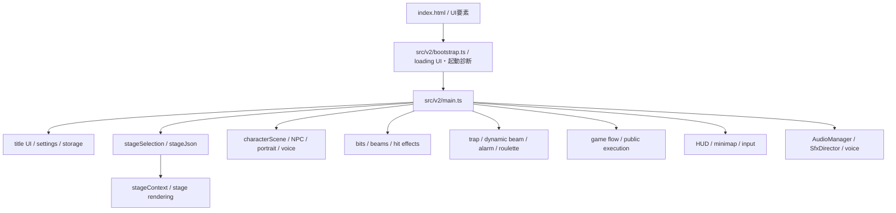
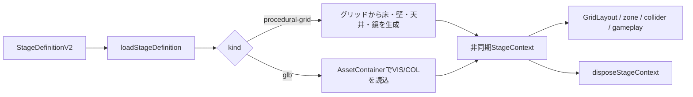

# HAIGURE SURVIVAL 技術・アーキテクチャ仕様書

更新日: 2026-09-06
対象バージョン: v1.3.1実装記録（V2現行規定を追補）
v1.3.1実装記録の基準develop: `0c8b438`

> [!IMPORTANT]
> 2026-07-19付の「V2移行規定」は、以下に残すv1.3.1／旧T02時点の実装記録より優先する。旧実装のJSON文字マップ、セルナビゲーション、`StageDefinitionV2`、`GridLayout`に関する記述を、V2の実行契約として参照してはならない。

## 0. V2移行規定（2026-07-19）

V2のステージ実行契約は現行の[V2ステージランタイム仕様書](./spec_stage_runtime_v2.md)、Blender／GLBの制作契約は[ステージ資産仕様書](./spec_stage_assets_v2.md)を正本とする。本節は両仕様書の要点を示す現行規定である。

- ステージ空間ランタイムの境界は、非所有`StageStaticSpatialView`、唯一の静的owner `OwnedStageStaticSpatialResources`、session所有`StageSpatialSession`とする。人間用`NavigationWorld`はsession、BIT用`NavigationWorld`は静的ownerに分離する。
- 空間情報の入力はGLBの3D meshes／markers／volumesと、事前ベイク済みRecast navmeshに統一する。JSON文字マップ、セル配列、実行時セル展開、セル由来ナビゲーションは使用しない。
- 光線衝突と視認判定は3D beam／sight queryとして実行する。X/Z平面のセル走査、2D壁距離、BFSセル経路をV2の判定根拠にしない。
- TypeScript側のステージカタログは、ID、表示情報、資産参照などの非空間情報だけを保持する。座標、文字マップ、セル物理、ゾーン形状、ナビゲーション形状は保持しない。
- V2の対象ステージは学校のみとする。既存8ステージはv1.3.1の履歴であり、V2移行、V2動作保証、V2データ変換の対象外とする。
- 旧`StageDefinitionV2`、`procedural-grid`、旧GLB用JSON、`GridLayout`、セルナビゲーションとの互換は禁止する。互換アダプター、フォールバック、旧形式コンバーター、旧新二重ロード経路を実装しない。
- 学校のPlayer開始地点は承認済み11 IDの固定順から一様抽選し、`player_spawn` Markerと`player_spawn_exclusion` Volumeを`hs_player_spawn_id`で1対1対応させる。選択済みの同一`StagePlayerSpawn`をPlayerとSurvivalへ渡し、名前推測、`no_enemy_spawn`流用、欠落時fallbackは行わない。
- session seedから`core`、`player-spawn`、`npc-spawn`、`bit-spawn`の独立乱数列を派生する。NPCは5個の`npc_spawn` Volumeによる全校チャンネルを重み`1.0`で常に残し、選択Player開始地点へ明示対応する`npc_spawn_bias`チャンネルを`hs_weight`で加える。初期値`0.5`では全校`2/3`・近傍`1/3`でチャンネルを選び、各チャンネル内は現在の人間用NavMeshとの実交差面積比例で抽選する。BITは全11許可飛行帯の`bit_spawn` VolumeとBIT用NavMeshとの実交差面積を重みにして連続面上から抽選する。
- 初期洗脳済みNPCを選択開始地点の除外Volume外へ先に配置し、通常NPCは全NPC間距離を引き継いで後から配置する。初期BIT、時間増援、Alertだけに選択開始地点の除外Volumeを適用する。
- V2通常設定はBIT初期1機、10秒間隔、最大25機とする。通常BITとAlertを上限へ含め、カーペット僚機は除外する。増援時間はplaying中だけ進み、上限中は0へ戻し、欠員後も1間隔につき1機だけ生成してcatch-up burstを行わない。

### 0.1 V2起動診断表示

`src/v2/bootstrap.ts`はloading UIを初回描画してから`src/v2/main.ts`を動的読込し、`src/v2/startupDiagnostics.ts`が`loading`、`stalled`、`failed`、`running`、`unloading`を管理する。起動から15秒未満の`loading`では既存の`NOW LOADING`と進捗を表示する。15秒以上継続した場合は`#titleStatusSlot`の`data-startup-diagnostics-state="stalled"`と起動診断専用の`#startupDiagnosticsMessage`を使い、読込継続中、停止phase、経過秒を表示する。`failed`では同じ属性を`failed`として同要素だけに起動エラーを表示し、`running`と`unloading`では属性と文面を消す。

`#titleStartHint`と`#titleMessage`は`titleOverlayController`が所有し、起動診断は両要素の子Node、本文、inline displayを変更しない。長時間loadingと失敗表示は、通常loading、Canvas再試行、設定反映待ち、2行の開始注記と重複させない。

### 0.2 T07性能計測と検証入口

V2性能計測は`src/v2/performanceDiagnostics.ts`の同一collectorを使用し、次の3 profileを区別する。

| profile | 入口と時間軸 | 用途 |
|---|---|---|
| `normal` | `performance=normal`。最初の`playing` frame入口を実時間0秒とし、`[0,10)`をcold、`[10,70)`をsteadyとする | `V2_DEFAULT_TITLE_SETTINGS`による通常構成の絶対性能受入 |
| `stress` | `performance=stress`。最初の`playing` frame入口から実時間`[0,120)`とする | 99 NPC、初期洗脳済み66、BIT 50、荒れ度10、Alarm有効の最大構成における完走、負荷成立、診断、保持、同条件前後比較。60fpsの合格条件には使用しない |
| `fixed-4200` | URLの`performance=acceptance`を内部で正規化し、固定delta 1/60でcold 600 frameとsteady 3,600 frameを採取する | I3／T06-1由来の歴史的比較。実時間70秒または120秒へ読み替えない |

3 profileはCPU frame work、次callbackまでのframe interval、旧`max(work, previous interval)`によるtotal、CPU section、Babylon render／mesh／draw call、GPU、計測区間内heap、Long Taskを別fieldで記録する。利用できないGPUやheapは`null`、機能の利用可否は`availability`へ保存し、0で補完しない。未完了と中断は`complete`から分け、`aborted`と理由を保持する。Long Taskは`entry.startTime`で窓へ帰属させ、最終frame interval後の遅延通知をdrainしてreportを確定し、report退避後にobserverを破棄する。

`normal`はcold／steadyの各runでframe intervalのp95を16.7ms以下、p99を25ms以下、最大を50ms以下、50ms超Long Taskを0件とする。`stress`はWeb／Electronを変更前後各3回採取し、`validation/v2/T07/comparePerformance.mjs`で中央値を比較する。CPU frame work、frame interval、旧totalのp95／p99と、計測後GCの主heap指標`usedSize`はそれぞれ悪化5%以内を条件とする。`backingStorageSize`は補助heap指標とし、取得不能または条件不一致を`unavailable`／`incomparable`から合格へ変換しない。

`stress`の操作負荷はraw key eventではなく、Player配置、完了状態選択、Follow、Player射撃、扉toggle、エレベーター呼出の意味requestとして記録・再生する。複数NPCへの接近配置とFollowを短時間に連続させる募集burstを含める。要求時刻、順序、ID、引数からhashを作り、同一runtimeの変更前後で同じrequest列を使う。実行時刻、許否、解決後配置はresultとして分離し、通常Runtimeの状態、距離、視線、NavMesh、安全判定を迂回しない。

強制GCは各性能計測窓内では実行しない。`validation/v2/T07/runRetainedHeap.mjs`は同一rendererでnormal完了とsession再開始を反復し、各GC直前に媒体観測ログをNode側へ退避してrenderer側配列を空にし、性能report履歴も最新1件だけ保持する。主heap指標はCDP `Runtime.getHeapUsage()`の`usedSize`とし、`backingStorageSize`、`performance.memory`、DOM／listener、Runtime owner状態は補助証拠として分ける。heap差だけで保持リーク0件と断定しない。

検証入口は`validation/v2/T07/runPerformance.mjs`、`comparePerformance.mjs`、`runRetainedHeap.mjs`、`runRegression.mjs`、`runStartupUi.mjs`、独立fixtureの`measurementRunner.mjs`とし、引数と証拠構成は`validation/v2/T07/README.md`を正本とする。変更前後ではruntime、端末・GPU・電源、1920×1080、DPR、seed、視点、人口、描画条件、素材fingerprint、入力request hash、計測器を一致させる。source identityは変更前・変更後の各3回内で固定し、両群の差分が対象の製品変更であることを照合する。

2026-09-06のユーザー訂正以降、新しいbuildと試験はWeb版だけを対象とする。上記のElectron計測はT07実施済み履歴の条件を表し、今後の受入条件には使用しない。Web buildは`npm run build:renderer`を使用する。

### 0.3 V2プレイ中HUDとデバッグ表示

`src/v2/debugMode.ts`の`V2_DEBUG_MODE`で詳細診断表示を切り替える。通常のテストプレイとcommitは`false`とし、画面上の設定や永続化項目は設けない。

- 通常モードでは詳細診断を非表示にし、ミニマップ下（左12px・上204px）へ操作説明を表示する。末尾に「NPC内訳 未洗脳者 n人  洗脳済み n人」「ビット n体」を加える。
- 未洗脳者は`frame.npcHudCounts.unbrainwashed`、洗脳済みは`frame.npcCount`との差で求め、hit-a／hit-b／progressを含む洗脳済み系状態を数える。戦闘用`brainwashedNpcCount`の定義は変更しない。
- ビットは`frame.bitCount`を使用し、出現演出開始から通常人口として数える。未出現の増援と、カーペット射撃の一時僚機は含めない。
- デバッグモードではミニマップ下に詳細診断、左下に操作説明を表示する。非表示時も詳細テキストの更新を維持し、既存QAが状態を読み取れるようにする。
- F／E／Cは成立した対象のHUDに表示し、操作説明へ常設しない。G／N／Hは解禁時だけ、R／Enterは現在フェーズに応じて表示する。
- 操作説明と詳細診断はMission HUDと同じ明るい境界線、角丸、半透明背景、影、文字の調子を使用する。高さ400px以下では通常操作説明の文字と余白を縮め、解禁後の6行表示を下部のPlayer操作表示より上へ収める。
- ミニマップ右の現在位置パネルも同じデザインを使用する。ミニマップ、Mission Location名、NPC／Follower現在地は`formatV2LocationDisplayName`を共用し、「3F-4F 北東階段」「4F-屋上 北東階段」などの階範囲名や、先頭・末尾に階名を含む「屋上プールサイド」「校舎屋上」へ現在階を重ねて付けない。通常室は「3F 美術室」のように現在階を付ける。
- 解禁後の下部操作案内は「G：銃あり 左クリック：発射  N：銃なし  H：ハイグレポーズ」とし、群内は半角1空白、群間は半角2空白を維持する。現在の群と枠はgunが黄緑`#9cff57`、no-gunが水色`#61e8ff`、progress／haigureが黄色`#ffd166`、他の群は白`#f5f5f5`にする。
- 下部操作案内のモード変更時は同行・扉と共通の180ms発光を使う。同一モードの連続更新と初回表示では再発光せず、非表示時に残光を解除する。中央配置の`translate`と発光の`scale`を分離し、発光中もパネルの中心を保つ。

以下の第1～16節はv1.3.1／旧T02時点の実装を追跡する付録として残す。V2実装との不一致は本節、`docs/spec_stage_runtime_v2.md`、`docs/spec_stage_assets_v2.md`を優先する。

## 1. v1.3.1／旧T02実装付録の位置付け

本節以降は、HAIGURE SURVIVAL v1.3.1の実装構成、主要データフロー、状態管理、保守上の制約を基準develop時点の履歴としてまとめる。当時のゲーム挙動は[ゲーム仕様書](./spec.md)、旧T02のステージデータ契約は[旧ステージJSON仕様書](./spec_stage_json.md)を参照すること。

## 2. 技術スタック

| 要素 | 採用技術 |
|---|---|
| 言語 | TypeScript 5.3 |
| 3Dエンジン | Babylon.js 6.49 |
| Webビルド | Vite 5 |
| デスクトップ | Electron 28 |
| パッケージ | npm |
| Windows配布 | electron-builder / NSIS |

V2のWebエントリーポイントは軽量な `src/v2/bootstrap.ts` であり、loading UIの初回描画後に `src/v2/main.ts` を読み込む。Electron側は `electron/main.ts` と `electron/preload.ts` である。HTMLは `index.html`、全体スタイルは `src/style.css` に置く。

### 2.1 npmコマンド

| コマンド | 用途 |
|---|---|
| `npm run dev` / `npm run dev:web` | Vite開発サーバー |
| `npm run dev:electron` | Vite、Electron用TypeScript監視、Electronを並行起動 |
| `npm run build:renderer` | Web成果物を `dist` へ出力 |
| `npm run build:electron` | Electronコードを `dist-electron` へ出力 |
| `npm run build` | WebとElectronを順にビルド |
| `npm run preview` | Web成果物の確認 |
| `npm run dist` | ビルド後にElectronインストーラーを `release` へ出力 |

## 3. 実行時の全体構成

`src/v2/bootstrap.ts` がloading UIと起動診断を先に成立させ、`src/v2/main.ts` がBabylon.jsのEngine、Scene、カメラ、タイトルUI、HUD、音声、ステージ、キャラクター、各ゲームシステムを生成してフレーム更新を調停する。機能別モジュールは状態と処理を提供するが、最終的なゲームSessionのライフサイクルと相互接続は `src/v2/main.ts` が保持する。



## 4. 主要モジュールの責務

### 4.1 起動・統合

| モジュール | 責務 |
|---|---|
| `src/v2/bootstrap.ts` | loading UIの初回描画、起動フェーズ診断、Runtime module読込 |
| `src/v2/main.ts` | 依存生成、設定適用、開始・リセット・タイトル復帰、フレーム更新、システム間連携 |
| `src/game/runtimeFrame.ts` | フレーム時間などランタイム更新の補助 |
| `src/game/titleStartPreparation.ts` | タイトル設定に対応する開始準備のデバウンス、キャッシュ、進捗管理 |
| `src/ui/titleOverlayController.ts` | タイトル中央表示、ローディング表示、開始可能表示 |

### 4.2 ワールド

| モジュール | 責務 |
|---|---|
| `src/world/stageSelection.ts` | 8ステージのカタログとv2定義取得、版・種別判定 |
| `src/world/stageJson.ts` | `StageDefinitionV2`、procedural-grid／GLB座標、グリッド・環境・ゲームプレイ変換 |
| `src/world/stageContext.ts` | v2定義から非同期に描画・衝突・ナビゲーション資源を構築し、コンテキスト単位で破棄 |
| `src/world/stage.ts` | 床、壁、天井、衝突、鏡面デカールをBabylon.jsメッシュとして生成 |
| `src/world/grid.ts` | セルレイアウト型とJSON不使用時の既定グリッド生成 |
| `src/game/gridUtils.ts` | セル座標とワールド座標の相互変換、ゾーン矩形中心のワールド変換 |

### 4.3 キャラクターと戦闘

| モジュール | 責務 |
|---|---|
| `src/game/types.ts` | キャラクター、NPC、ビット、光線などの共有ランタイム型 |
| `src/game/characterScene.ts` | プレイヤー／NPCスプライト、ボイスアクター、描画資源の統合管理 |
| `src/game/portraitSprites.ts` | 状態別画像の検出、読込、スプライトシート生成、接触洗脳ブレンド生成 |
| `src/game/npcs.ts` | NPC生成、回避、洗脳状態遷移、経路移動、追跡、妨害、射撃 |
| `src/game/npcNavigation.ts` | 到達可能性、BFS経路、NPC移動先の計算 |
| `src/game/bits.ts` | ビット生成、行動モード、探索、攻撃、アラート、カーペット爆撃、出現・消滅演出 |
| `src/game/beams.ts` | 光線メッシュ、移動、壁衝突、残像、命中光球、持続光線 |
| `src/game/beamCollision.ts` | 光線とキャラクターの楕円体相当判定 |
| `src/game/hitEffects.ts` | 命中点滅、フェード、光球の共通シーケンス |
| `src/game/playerAbility.ts` | プレイヤー移動可否、ダッシュ、スタミナ、洗脳後能力 |

### 4.4 ゲーム進行と専用システム

| モジュール | 責務 |
|---|---|
| `src/game/phases.ts` | `GamePhase` とフェーズ別入力・表示判定 |
| `src/game/flow.ts` | 全滅後の整列、カメラ移動、公開処刑配置 |
| `src/game/publicExecutionController.ts` | 公開処刑候補判定、方式決定、発射・命中・リプレイ |
| `src/game/trap/system.ts` | トラップルームの予告、候補抽選、発射数増加、NPC停止 |
| `src/game/dynamicBeam/system.ts` | `D`セル群の予告、持続光線、次候補切替 |
| `src/game/alarm/system.ts` | アラーム床の追加、点滅、踏破判定、追跡キュー |
| `src/game/roulette/system.ts` | ラウンド状態、スナップショット、Undo、統計 |

### 4.5 UI、設定、音声

| モジュール | 責務 |
|---|---|
| `src/ui/titleSettingsSidebar.ts` | タイトル設定パネルの合成、モード切替、警告、リセット |
| `src/ui/titleOverlayController.ts` | タイトルの読込進捗とステージ読込エラー表示 |
| `src/ui/titleSettingsStorage.ts` | localStorageへの保存、読込、値の正規化 |
| `src/ui/titleStageRules.ts` | ルーレット選択時の設定無効化とランタイム値補正 |
| `src/ui/input.ts` | キーボード、ポインタ、ポインタロックの入力経路 |
| `src/ui/hud.ts` | ミニマップ、状態情報、操作説明、照準、スタミナ表示 |
| `src/audio/audio.ts` | BGM、SE、VOICEの音量と空間音声スロット |
| `src/audio/sfxDirector.ts` | ビット・光線・命中などのSE選択と距離区分 |
| `src/audio/voice.ts` | manifestに従う状態別ボイスと欠損候補の除外 |

## 5. 起動と開始準備

1. `main.ts` がCanvas、Engine、Scene、タイトルUI、設定パネルを初期化する。
2. localStorageから設定を読み、ステージID、音量、各設定値を正規化する。
3. 選択中のv2ステージ定義を `fetch(..., { cache: "no-store" })` で取得し、版とUnion判別子を確認する。
4. キャラクター割当を作成し、必要なポートレートスプライトシートだけを遅延生成する。
5. タイトル設定の指紋が変わると開始準備をデバウンスし、同じ設定の準備結果を再利用する。
6. 左クリック時に準備完了を待ち、通常開始またはいきなり公開処刑開始へ進む。

ステージ取得失敗、未対応版、未知の種別はエラーとする。旧JSON形式や組込み3部屋グリッドへのフォールバックは行わない。全項目を検証する汎用スキーマ検証器は持たず、規約準拠データを前提とする。

## 6. ステージ構築データフロー



- procedural-gridはJSON列を左右反転し、`mapScale`に従って展開する。既存8ステージのセルサイズは`1 / 3`ワールド単位である。
- GLBの平面グリッドはBlender資産原点・メートル基準で、列`+X`／行`+Y`をBabylon `-X`／`-Z`へ0.25倍変換する。
- `GridLayout`はセル(0,0)のワールド中心と行・列方向を保持し、両形式のセル／ワールド変換を共通化する。
- 新コンテキストを完成させてから旧コンテキストを破棄し、競合して古くなったロード結果は即時破棄する。
- procedural-gridは生成Mesh、Material、Texture、反射資源を、GLBはAssetContainer、管理ノード、作者Mesh、Material、Textureをまとめて破棄する。

## 7. ゲームフェーズ

| フェーズ | 用途 |
|---|---|
| `title` | タイトル、設定、開始準備 |
| `playing` | 通常サバイバル |
| `roulette` | ルーレット専用進行 |
| `transition` | 公開処刑前の遷移 |
| `assemblyMove` | 全滅後の自動整列 |
| `assemblyHold` | 整列完了後の保持 |
| `assemblyFree` | 整列を中断した自由操作 |
| `execution` | 公開処刑 |

フェーズ判定は、タイトル復帰可否、右クリックメニュー抑止、一人称身体表示、プレイヤー視点高の使用、プレイヤー位置同期、HUD表示へ共通利用する。

## 8. キャラクターと戦闘のデータフロー

1. フレーム開始時に入力とプレイヤー移動を反映する。
2. NPCは対象一覧、脅威、アラームキュー、到達可能性から状態と移動を更新する。
3. ビットは視界、対象、生存時間、アラート状態、壁距離からモードを更新する。
4. ビット、NPC、プレイヤー、トラップ、動的ビームが光線を生成する。
5. 光線は壁とキャラクターの衝突を判定し、命中時に引き戻しとヒットシーケンスを開始する。
6. キャラクター状態を更新し、スプライトセル、ボイス、床影、HUDへ反映する。
7. 公開処刑候補、全滅条件、専用ステージ進行を評価する。

キャラクターの見た目はSprite、当たり判定は状態に応じた横・縦半径、移動衝突はプレイヤー用Meshおよびセル地形として分離されている。

## 9. NPCとビットAI

### 9.1 NPC

- 生存NPCはランダム移動と脅威回避を行う。
- 洗脳済みNPCはBFSで未洗脳対象へ回り込み、視認対象またはアラーム対象を追う。
- 銃ありNPCは射程内で発射する。
- 銃なしNPCは接触洗脳ON時には対象を変化させ、OFF時には移動ブロッカーとアラート要求を生成する。
- NPCの現在セル、目標セル、経路、移動方向は状態として保持し、毎フレームの経路再構築を避ける。

### 9.2 ビット

`BitMode` は次の9種類である。

- `search`
- `search-bruteforce`
- `attack-chase`
- `attack-fixed`
- `attack-random`
- `alert-send`
- `alert-receive`
- `attack-carpet-bomb`
- `hold`

各ビットは対象ID、モードタイマー、射撃クールダウン、探索向き、アラート復帰状態、カーペット編隊状態、出現・消滅状態を保持する。赤ビットは視界、速度、旋回、発射間隔などへ倍率を適用する。

## 10. 公開処刑

公開処刑候補は、プレイヤーとNPCの生存状態、NPCがプレイヤーまたはNPCに妨害されている状態、ビット数から組み立てる。中心対象は最大6人である。

`ExecutionConfig` は次を保持する。

- `variant`: プレイヤー生存、NPC生存＋プレイヤー妨害、NPC生存＋NPC妨害
- `survivorTargets`: プレイヤーまたはNPCの対象一覧
- `blockKindsByTargetKey`: 対象ごとの妨害者種別
- `playerExecutionRole`: 対象、射手、観客
- `usesNpcVolley`: NPC一斉射撃を使うか

`flow.ts` が位置・カメラ・観客リングを構築し、`publicExecutionController.ts` が遅延、同時発射抽選、射手、命中状態、リプレイを管理する。通常候補では遷移待ち1秒、発射待ちは2～8秒、複数対象の同時発射確率は30%である。

## 11. ステージID依存機能

ステージJSONの内容だけでなく、選択IDで有効化される処理がある。

| ID | 実装上の特別扱い |
|---|---|
| `arena_trap_room` | TrapSystemを更新し、トラップHUDを表示 |
| `labyrinth_dynamic` | DynamicBeamSystemを更新し、`D`セル群を使用 |
| `arena_roulette` | RouletteSystemへ移行し、タイトル設定を制限 |

鏡面はIDではなく、JSONの対応済み `decals[].reflective.kind = "mirror"` により生成する。アラームはステージIDではなくタイトル設定で有効化するが、ルーレットでは強制OFFとなる。

## 12. 設定の永続化

- キー: `haigure-survival.title-settings`
- v1.3.1時点の保存バージョン: `6`
- 保存契機: タイトル設定変更

保存形状は次のとおりである。

```ts
type PersistedTitleSettings = {
  version: number;
  volumeLevels: { bgm: number; se: number; voice: number };
  stageId: string;
  alarmTrapEnabled: boolean;
  playerSettings: PlayerSettings;
  defaultStartSettings: DefaultStartSettings;
  brainwashSettings: BrainwashSettings;
  bitSpawnSettings: BitSpawnSettings;
  executeSettings: ExecuteSettings;
};
```

読込時は数値範囲、真偽値、ステージID、画像・ボイスディレクトリ、処刑方式、割合合計を正規化していた。v1.3.1時点ではv6と直前v5だけを受け入れ、それ以外は既定値へ戻していた。正規化で値が変わった場合は修正済みデータを保存し直していた。

## 13. 素材の検出と読込

Viteの `import.meta.glob` を使用するため、素材一覧はビルド時に決まる。実行時にフォルダへ追加しただけでは既存ビルドへ反映されない。

| 種別 | glob | 備考 |
|---|---|---|
| BGM | `/public/audio/bgm/*.mp3` | `meta.name` 同名を優先 |
| SE | `/public/audio/se/*.mp3` | 存在するURLだけ再生 |
| VOICE | `/public/audio/voice/*/*.wav` | manifest候補から実在ファイルだけ選ぶ |
| キャラクター | `/public/picture/chara/*/*.{...}` | 8種類の画像拡張子に対応 |

ポートレートはディレクトリ単位で状態画像をCanvasへ合成し、Blob URLのスプライトシートを生成する。接触洗脳ON時だけ `hit-b` から `hit-a` への16段階＋終端の合成セルを追加する。タイトル開始準備は使用予定ディレクトリだけを先行生成する。

ボイスは `voiceManifest.json` の候補と実在globを交差させる。欠損候補は無音スキップし、ポーズ状態のenter音声が0件でも後続loop処理を止めない。

## 14. 描画と音声

- メインカメラ、反射カメラ、一人称身体用レイヤーを分ける。
- キャラクターはカメラ向きに追従するビルボードで、設定により縦角度追従を切り替える。
- 透明画像の奥側描画を防ぐため、キャラクターメッシュの描画順とマテリアル設定を分離する。
- 床影はキャラクター用楕円とビット用形状を動的テクスチャで生成する。
- 鏡はReflectionTextureと反射面ごとのクリップ平面を使用する。
- AudioManagerはカテゴリ音量と空間音声を管理し、SfxDirectorは距離と状況に応じてSEを選ぶ。

## 15. 主要な調整箇所

全定数ではなく、ゲームバランス上よく変更される箇所を示す。

| 対象 | 主な場所 |
|---|---|
| 初期NPC、初期洗脳、ビット間隔・上限、プレイヤー視点 | `src/main.ts` |
| ダッシュ倍率、スタミナ | `src/main.ts`、`src/game/playerAbility.ts` |
| ビットモード別性能 | `src/game/bits.ts` |
| NPC速度、接触距離、状態遷移 | `src/game/npcs.ts` |
| 命中演出 | `src/main.ts`、`src/game/npcs.ts`、`src/game/hitEffects.ts` |
| トラップ抽選 | `src/game/trap/system.ts` |
| 動的ビーム時間 | `src/game/dynamicBeam/system.ts` |
| アラーム間隔・影響範囲 | `src/game/alarm/system.ts` |
| 公開処刑人数・待ち時間 | `src/game/publicExecutionConfig.ts` |

## 16. v1.3.1基準実装上の制約

- 自動テスト用スクリプトはpackage.jsonに定義されておらず、主な静的検証はTypeScriptビルドである。
- v2ステージ定義は版とUnion判別子だけを実行時確認し、全項目のランタイムスキーマ検証は行わない。
- `main.ts` が多数のランタイム状態とシステム接続を保持するため、開始・リセット・タイトル復帰の変更は複数システムの破棄・再同期を確認する必要がある。
- 専用ステージ機能はカタログIDとの一致を前提とする。
- JSONの一部フィールドは型上存在したが未使用だった。詳細は[旧ステージJSON仕様書](./spec_stage_json.md)を参照すること。
- キャラクターディレクトリを検出した場合、各必須状態画像が揃っていることを前提とする。
